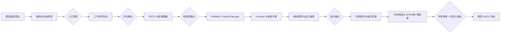

# Medical Agent

面向医院医生、科研人员和审核专家的中文医疗科研辅助系统。系统把“研究想法”拆分为可恢复、
可审计、带人工确认点的 18 步工作流，覆盖研究问题结构化、文献检索与核验、观察性研究设计、
统计草案、引用追溯、STROBE 预检查、专家审核和受控 DOCX 导出。

> 本项目用于科研设计辅助，不用于诊断、治疗、临床决策或真实患者明细分析。当前外部模型
> 生产审批、真实脱敏医院模板和专家评测尚未完成，不能把开发验证结果视为医院生产验收。

## 文档导航

- [系统详细架构设计](doc/架构设计/系统详细架构设计.md)
- [当前实施进度](doc/开发记录/实施进度.md)
- [实施日志](doc/开发记录/实施日志.md)
- [本地中间件](doc/开发记录/本地中间件.md)
- [架构决策记录](doc/ADR/)
- [完整开发框架](doc/开发方案/医疗研究Agent完整开发框架.md)
- [开发实施方案](doc/开发方案/医疗研究Agent开发实施方案.md)

## 当前状态

当前处于阶段 7“安全、评测与部署基线”。阶段 2～6 可编码主链已实现到 STEP18，
并完成 PostgreSQL、MinIO、ClamAV、LibreOffice 和 DeepSeek 的指定范围实机验证。
运行健康、本地启停/冒烟、离线一致备份和新目标恢复演练已完成，安全扫描按当前安排暂缓。

| 范围 | 当前状态 |
| --- | --- |
| 18 步 Agent 主链 | 已实现，支持持久化、人工确认、取消、重试、租约恢复和 SSE 补发 |
| 身份与多医院隔离 | 已实现，包含 Cookie 会话、CSRF、角色和课题成员权限 |
| PostgreSQL / Flyway | V1～V19 已实机迁移，44 张业务表，另有 `flyway_schema_history` |
| MinIO | 文件、外部工具原始响应、模板和导出文档读写闭环已验证 |
| ClamAV | 1.5.3 实机接入；安全文件、EICAR 和失败关闭路径已验证 |
| 运行健康 | Actuator 最小暴露；PostgreSQL、MinIO、ClamAV 深度检查和本地冒烟已通过 |
| 备份恢复 | PostgreSQL custom archive + MinIO mirror + SHA-256 manifest；临时恢复演练已通过 |
| DeepSeek | 当前本地运行脚本已接入真实 API；Java 契约与 STEP01→STEP07 浏览器链路通过，生产数据审批未完成 |
| PubMed | 适配器和协议测试已完成；本机缺少已注册的 `PUBMED_EMAIL`，真实联机测试待执行 |
| ClinicalTrials.gov / Crossref | 真实 API 适配器已实现并完成指定联机验证 |
| DOCX | 受控模板 v2、两套合成模板、STEP18 导出和 LibreOffice 视觉检查已完成 |
| 前端依赖审计 | 完整 `npm audit` 为 0 漏洞 |
| Java 依赖 SCA | OWASP Dependency-Check 首次 NVD 数据同步尚未收口，不宣称已通过 |
| Docker / 镜像扫描 | 当前机器未安装 Docker，相关环境测试明确跳过 |

详细、持续更新的状态以[实施进度](doc/开发记录/实施进度.md)为准。

## 核心流程



工作流不会用一次大模型调用直接生成整份方案。每个步骤保存输入、输出、Schema 版本、
尝试次数、Prompt/工具信息、错误和确认记录；浏览器关闭不会中断后台任务。

## 主要能力

### 身份、权限与审计

- 医院代码、用户名、密码登录；密码使用 BCrypt cost 12。
- 不透明 `MEDICAL_SESSION` Cookie；服务端只保存令牌 SHA-256。
- Cookie 为 `HttpOnly; SameSite=Strict`，生产环境强制 `Secure`。
- 写接口使用 `XSRF-TOKEN` / `X-XSRF-TOKEN` 执行 CSRF 校验。
- 首次登录强制改密；改密和禁用账号会撤销已有会话。
- 连续 5 次登录失败后锁定 15 分钟。
- 平台角色：`DOCTOR`、`EXPERT`、`HOSPITAL_ADMIN`、`PLATFORM_ADMIN`、`AUDIT_ADMIN`。
- 课题成员角色：`OWNER`、`EDITOR`、`VIEWER`。
- 医院、用户、课题、文件、任务、审核和导出等关键动作写入审计记录。

### 多医院与课题隔离

- 共享 PostgreSQL、共享表，通过 `hospital_id` 隔离。
- 普通 API 不接受客户端提供的医院标识，医院范围只从认证上下文取得。
- 课题查询和更新同时校验医院范围与课题成员关系。
- 医院内唯一键使用 `(hospital_id, business_key)` 联合约束。
- 对象存储路径包含医院、课题和随机资源标识。
- 跨医院项目、任务、成员、取消和导出边界有自动化测试。

### 文件安全流水线

上传支持 PDF、DOCX、TXT 和 MD，单文件上限 20MB，依次执行：

1. 文件名清洗、扩展名和 MIME 白名单检查。
2. PDF/DOCX 魔数检查，DOCX ZIP 包结构与条目数量检查。
3. ClamAV INSTREAM 或基础 EICAR 特征扫描。
4. PDFBox / Apache POI / UTF-8 文本提取。
5. 敏感内容规则检查并产生安全状态。
6. 计算 SHA-256。
7. 写入 MinIO 隔离路径。
8. 写入 PostgreSQL 元数据；数据库失败时补偿删除 MinIO 对象。

生产 profile 强制使用 ClamAV。扫描服务连接失败、超时或返回未知状态时拒绝文件入库。

### 外部模型安全

- 配置文件的保守默认值仍为 `mock`，仅服务于无外部调用的确定性测试；当前 Windows 本地启动
  脚本强制使用 `deepseek`，运行实例不设置 Mock 回退。
- DeepSeek 只有在同时设置 `mode=deepseek` 和
  `MEDICAL_MODEL_EXTERNAL_ENABLED=true` 时才允许初始化。
- 密钥只从服务端环境变量或密钥文件读取，前端不能指定供应商、模型名、Base URL 或密钥。
- 最终出站调用点统一执行 4,000 字符限制、敏感标识和 Prompt Injection 检查。
- 被拒绝的输入不会产生网络请求，错误只包含规则码，不回显敏感内容。
- 模型返回值必须解析为版本化 JSON 契约；失败时显式报错，不切换未审批供应商，也不编造结果。

### 文献与证据链

- STEP08：PubMed ESearch、ESummary、EFetch 三段响应交叉校验。
- STEP09：ClinicalTrials.gov API v2 注册研究检索。
- STEP10：Crossref DOI 元数据核验和注册研究—论文关联。
- 原始响应写入 MinIO，数据库保存对象键、工具版本、请求数和 SHA-256。
- PMID、NCT ID、DOI、题名和字段级核验结果结构化保存。
- 注册记录保持 `TRIAL_REGISTRY` 属性，不当作同行评议论文证据。
- 当前没有合法 PMC 全文接入，因此引用支持范围只标记为摘要或元数据级。

### 方案、审核与导出

- STEP12 按队列、横断面和病例对照三类规则生成可重放设计建议。
- STEP13 生成 18 个中文方案章节，每章独立版本化。
- STEP14 生成统计分析草案；样本量参数保持 `MISSING_NEEDS_INPUT`，不猜测数值。
- STEP15 建立事实性主张与已核验 PubMed 引文之间的可追溯链接。
- STEP16 按 STROBE 22 个主条目执行完整性预检查，不生成总分或质量排名。
- STEP17 要求同院课题专家提交可定位批注与决定，再由课题负责人确认并锁定章节。
- STEP18 只允许负责人使用本院已发布模板和引用格式导出。
- 导出记录保存方案、引文快照哈希、模板版本、引用格式版本和文件 SHA-256。

## 技术栈

| 层 | 技术 |
| --- | --- |
| 后端 | Java 21、Spring Boot 3.5.16、Spring Security、Spring JDBC |
| AI 抽象 | Spring AI 1.1.8、自定义 `ModelRouter`、DeepSeek OpenAI 兼容 API |
| 数据库 | PostgreSQL 18、pgvector 0.8.0、Flyway V1～V19 |
| 对象存储 | MinIO、MinIO Java SDK 9.0.1 |
| 文件处理 | Apache POI 5.4.1、Apache PDFBox 3.0.8、ClamAV 1.5.3 |
| 前端 | Vue 3.5、TypeScript 5.9、Vite 7、Element Plus、Pinia、Vue Router、Axios |
| 测试 | JUnit 5、AssertJ、Mockito、WireMock、ArchUnit、Vitest、Playwright |
| 文档验收 | LibreOffice 26.2.4.2 |

## 仓库结构

```text
MEDICAL_AGENT/
├─ backend/
│  ├─ src/main/java/com/jarylee/medicalagent/
│  │  ├─ agent/          # 模型路由、Prompt、Mock 与 DeepSeek
│  │  ├─ auth/           # 认证、会话、CSRF 与角色
│  │  ├─ audit/          # 操作审计
│  │  ├─ research/       # 课题和成员
│  │  ├─ file/           # 上传、扫描、提取与对象存储
│  │  ├─ literature/     # PubMed、ClinicalTrials.gov、Crossref
│  │  ├─ workflow/       # 18 步任务、Worker 和科研生成服务
│  │  ├─ review/         # 专家审核
│  │  ├─ document/       # 模板、引用格式和 DOCX 导出
│  │  ├─ safety/         # 敏感内容与 Prompt Injection 门禁
│  │  └─ common/         # 统一响应、异常、Trace ID、OpenAPI
│  ├─ src/main/resources/
│  │  ├─ db/migration/   # Flyway V1～V19
│  │  ├─ prompts/        # 版本化 Prompt
│  │  ├─ rules/          # 观察性研究规则
│  │  ├─ evaluation/     # 合成匿名评测集
│  │  └─ templates/      # 内置匿名 DOCX 模板
│  └─ src/test/          # 单元、HTTP、架构和条件式实机测试
├─ frontend/
│  ├─ src/api/           # Axios API 适配
│  ├─ src/stores/        # Pinia 会话
│  ├─ src/views/         # 原型页与工作台
│  ├─ src/components/    # 主要业务面板
│  └─ e2e/               # Playwright
├─ deploy/               # 本地 PostgreSQL/MinIO Compose
├─ tools/                # 本地启动、模板生成和 DOCX 校验脚本
├─ doc/ADR/              # 架构决策记录
├─ doc/架构设计/         # 当前实现的详细架构
├─ doc/开发方案/         # 目标框架与实施方案
├─ doc/开发记录/         # 实施进度、日志和验证记录
└─ artifacts/            # 合成测试和视觉验收产物
```

## 运行模式

### `memory`

默认 profile。数据库仓储和对象存储均使用进程内实现，适合快速演示和确定性测试。
进程退出后数据丢失，不代表生产语义，不用于验证 PostgreSQL 锁、JSONB 或隔离索引。

### `postgres`

启用 PostgreSQL、Flyway 和 JDBC 仓储。`MINIO_ENABLED=true` 时使用 MinIO；否则对象存储操作
会失败关闭。该模式适合本地集成测试和正式持久化。

### `postgres,prod`

生产部署必须同时启用两个 profile。`prod` 额外执行：

- 会话 Cookie 强制 `Secure`。
- Swagger UI 和 OpenAPI 关闭。
- 安全过滤链不匿名放行开发文档端点。
- 文件扫描模式强制为 `clamav`。

生产入口仍需由 HTTPS/HSTS 反向代理保护。

## 环境要求

### 最小开发环境

- JDK 21
- Maven 3.9+
- Node.js 24 和 npm

### 完整集成环境

- PostgreSQL 18，管理员预装 pgvector
- MinIO
- ClamAV 1.5.3 或兼容 clamd INSTREAM 服务
- LibreOffice 26.2.4.2，仅在 DOCX 视觉验收时需要

### 默认端口

| 服务 | 地址 |
| --- | --- |
| 前端 Vite | `http://127.0.0.1:5173` |
| 后端 API | `http://127.0.0.1:8080` |
| PostgreSQL | `127.0.0.1:5432` |
| MinIO API | `http://127.0.0.1:9000` |
| MinIO Console | `http://127.0.0.1:9001` |
| ClamAV clamd | `127.0.0.1:3310` |

## 快速启动

以下命令默认从仓库根目录执行。

### 方式一：内存模式快速演示

PowerShell：

```powershell
$env:BOOTSTRAP_ADMIN_USERNAME='platform-admin'
$env:BOOTSTRAP_ADMIN_PASSWORD='ChangeMe12345'

Set-Location backend
mvn spring-boot:run
```

首次创建的平台管理员没有医院代码，登录后必须修改初始密码，再创建医院和医院用户。

启动前端：

```powershell
Set-Location frontend
npm ci
npm run dev
```

浏览器访问 `http://127.0.0.1:5173`。Vite 将 `/api` 代理到
`http://localhost:8080`，避免本地跨域配置。

### 方式二：当前 Windows 本机完整环境

当前工作区的辅助脚本按以下本机目录工作：

- JDK：`D:\develop\jdk21`
- PostgreSQL：`D:\develop\postgresql18`
- MinIO：`D:\develop\minio`
- ClamAV：`D:\develop\clamav`
- 工作区：`D:\develop\AIWorkspace\MEDICAL_AGENT`

```powershell
# 可单独启动；后端脚本也会检查并按需启动 ClamAV。
.\tools\start-local-clamav.ps1

# 使用 postgres profile、MinIO 和 FILE_SCAN_MODE=clamav。
.\tools\start-local-backend.ps1

Set-Location frontend
npm run dev

# 回到仓库根目录后检查全部本地服务并执行安全冒烟。
Set-Location ..
.\tools\status-local.ps1
.\tools\smoke-local.ps1

# 只安全停止本项目后端，不影响 PostgreSQL、MinIO、ClamAV 或前端。
.\tools\stop-local-backend.ps1
```

`start-local-backend.ps1` 会从本机 DPAPI 凭据文件读取 MinIO 密钥，并从未跟踪的
`deepseek_token.txt` 读取真实 DeepSeek 凭证，不会把明文写入仓库或命令。令牌缺失或为空时
启动失败。它会校验 8080 端口归属、等待 ClamAV，并在后端总健康为 `UP` 后成功返回。停服脚本
也会先校验监听进程确为本项目 JAR。上述脚本只适用于当前 Windows 开发机，不是通用生产启动器。

### 方式三：用 Docker Compose 启动中间件

Compose 文件只启动 PostgreSQL/pgvector 和 MinIO，不包含后端、前端或 ClamAV。

```powershell
Copy-Item .env.example .env.local
# 编辑 .env.local，替换所有示例密码。

docker compose --env-file .env.local -f deploy/docker-compose.dev.yml config
docker compose --env-file .env.local -f deploy/docker-compose.dev.yml up -d
```

随后设置后端环境变量并使用 `postgres` profile。当前开发机没有 Docker，因此该路径仅经过
配置检查，Testcontainers 测试会明确跳过。

## 后端构建与测试

```powershell
Set-Location backend
mvn test
mvn -DskipTests package
java -jar target/medical-agent-0.1.0-SNAPSHOT.jar
```

若系统 Maven 绑定了旧 JDK，先设置：

```powershell
$env:JAVA_HOME='D:\develop\jdk21'
$env:Path="$env:JAVA_HOME\bin;$env:Path"
```

当前开发机也可以直接使用：

```powershell
& 'D:\develop\environment\apache-maven-3.9.11\bin\mvn.cmd' test
```

### ClamAV 实机测试

```powershell
$env:CLAMAV_LIVE_TEST='true'
$env:CLAMAV_HOST='127.0.0.1'
$env:CLAMAV_PORT='3310'

Set-Location backend
mvn -Dtest=ClamAvMalwareScannerTest test
```

测试覆盖安全内容、EICAR 和服务不可用时失败关闭。

### 条件式实机测试

以下测试默认跳过，只有显式开启并准备好依赖后才运行：

| 范围 | 开关 |
| --- | --- |
| PostgreSQL 仓储 | `-DlivePostgres=true` |
| PostgreSQL 空库 Flyway | `-DlivePostgresFlyway=true` |
| PostgreSQL/MinIO 完整 API | `-DlivePostgresApi=true` |
| MinIO | `-DliveMinio=true` |
| ClinicalTrials.gov | `-DliveClinicalTrials=true` |
| Crossref | `-DliveCrossref=true` |
| PubMed | 有效 `PUBMED_EMAIL` |
| DeepSeek 单次调用 | `RUN_DEEPSEEK_LIVE_TEST=true` |
| DeepSeek 对照评测 | `RUN_DEEPSEEK_EVALUATION=true` |

外部模型测试只允许使用匿名、虚构或公开数据。

### 真实 DeepSeek 完整测试

```powershell
Set-Location D:\develop\AIWorkspace\MEDICAL_AGENT
.\tools\test-deepseek-live.ps1
```

脚本依次执行后端全量回归、真实 Java API 契约、前端 lint/typecheck/Vitest/build，并在隔离的
18080/4174 环境运行 Playwright。当前结果为 PASS：94 个后端测试中 82 通过、12 个环境条件
跳过；Playwright 1/1 在 30.2 秒内真实完成 STEP01→STEP07，运行 Provider 为 `deepseek`，
Mock 回退关闭。详见[测试方案与执行记录](doc/测试/真实DeepSeek-API接入测试方案.md)。

## 前端构建与测试

```powershell
Set-Location frontend
npm ci
npm audit --audit-level=high
npm run lint
npm run typecheck
npm run test
npx playwright install chromium
npm run test:e2e
npm run build
```

前端当前包含两个懒加载路由：

- `/`：研究想法原型页。
- `/workspace`：登录、课题、文件、Agent、审核和导出工作台。

前端权限指令只用于界面可见性；真正授权始终由后端执行。

## 关键配置

完整示例见 [.env.example](.env.example)。真实凭据只允许放在未跟踪文件或部署密钥系统中。

### 应用与数据

| 环境变量 | 默认值 | 说明 |
| --- | --- | --- |
| `SPRING_PROFILES_ACTIVE` | `memory` | 正式部署使用 `postgres,prod` |
| `DATABASE_URL` | `jdbc:postgresql://localhost:5432/medical_agent` | PostgreSQL JDBC URL |
| `DATABASE_USERNAME` | `medical_agent` | 应用角色 |
| `DATABASE_PASSWORD` | 空 | 数据库密码 |
| `BOOTSTRAP_ADMIN_USERNAME` | 空 | 首次平台管理员 |
| `BOOTSTRAP_ADMIN_PASSWORD` | 空 | 首次平台管理员初始密码 |
| `SECURE_COOKIE` | `false` | 非 prod 下是否发送 Secure Cookie |

### MinIO 与 ClamAV

| 环境变量 | 默认值 | 说明 |
| --- | --- | --- |
| `MINIO_ENABLED` | `false` | postgres 模式是否启用 MinIO |
| `MINIO_ENDPOINT` | `http://127.0.0.1:9000` | MinIO API |
| `MINIO_ACCESS_KEY` / `MINIO_SECRET_KEY` | 空 | MinIO 凭据 |
| `MINIO_BUCKET` | `medical-agent-files` | 应用存储桶 |
| `FILE_SCAN_MODE` | `basic` | `basic` 或 `clamav`；prod 强制 clamav |
| `CLAMAV_HOST` / `CLAMAV_PORT` | `127.0.0.1` / `3310` | clamd 地址 |
| `CLAMAV_TIMEOUT` | `5s` | 连接和读取超时 |

### Agent 运行时

| 环境变量 | 默认值 | 说明 |
| --- | --- | --- |
| `AGENT_WORKER_DELAY` | `500` | Worker 轮询间隔，毫秒 |
| `AGENT_WORKER_INITIAL_DELAY` | `1000` | 首次轮询延迟，毫秒 |
| `AGENT_LEASE_DURATION` | `30s` | 任务租约 |
| `AGENT_TASK_TIMEOUT` | `15m` | 单任务总超时 |
| `AGENT_SSE_TIMEOUT` | `30m` | SSE 连接超时 |

### 模型与外部工具

| 环境变量 | 默认值 | 说明 |
| --- | --- | --- |
| `MEDICAL_MODEL_MODE` | `mock` | `mock` 或 `deepseek` |
| `MEDICAL_MODEL_EXTERNAL_ENABLED` | `false` | 外部模型第二道显式开关 |
| `MEDICAL_MODEL_NAME` | `deepseek-v4-flash` | 服务端模型名 |
| `MEDICAL_MODEL_BASE_URL` | `https://api.deepseek.com` | DeepSeek Base URL |
| `MEDICAL_MODEL_API_KEY` | 空 | 密钥管理系统注入 |
| `MEDICAL_MODEL_API_KEY_FILE` | 空 | 本地密钥文件 |
| `PUBMED_MODE` | `mock` | `mock` 或 `live` |
| `PUBMED_TOOL` / `PUBMED_EMAIL` | 见示例 | NCBI 注册工具信息 |
| `CLINICAL_TRIALS_MODE` | `mock` | `mock` 或 `live` |
| `CROSSREF_MODE` | `mock` | `mock` 或 `live` |
| `CROSSREF_MAILTO` | 空 | 真实邮箱可进入 polite pool |

## 外部服务启用

### DeepSeek

```powershell
$env:MEDICAL_MODEL_MODE='deepseek'
$env:MEDICAL_MODEL_EXTERNAL_ENABLED='true'
$env:MEDICAL_MODEL_API_KEY_FILE='D:\develop\AIWorkspace\MEDICAL_AGENT\deepseek_token.txt'
```

也可通过密钥系统设置 `MEDICAL_MODEL_API_KEY`。两种方式均未配置时应用拒绝启动。
`deepseek_token.txt` 已加入 Git 忽略名单。

### PubMed E-utilities

```powershell
$env:PUBMED_MODE='live'
$env:PUBMED_TOOL='medical_research_agent'
$env:PUBMED_EMAIL='registered-contact@example.org'
# 可选：$env:PUBMED_API_KEY
```

`PUBMED_EMAIL` 必须是实际随工具注册的联系邮箱。无 API Key 默认限制为 3 次/秒，有 Key 为
10 次/秒；只对瞬时网络或服务错误执行有界重试。

### ClinicalTrials.gov API v2

```powershell
$env:CLINICAL_TRIALS_MODE='live'
```

无需 API Key。客户端使用 12 小时本地缓存、保守节流和有界重试。

### Crossref REST API

```powershell
$env:CROSSREF_MODE='live'
$env:CROSSREF_MAILTO='registered-contact@example.org'
```

邮箱留空时使用 public pool，不伪造身份；设置真实邮箱后使用 polite pool。

## API 概览

所有普通响应使用统一结构：

```json
{
  "success": true,
  "data": {},
  "error": null,
  "timestamp": "2026-07-29T00:00:00Z",
  "traceId": "a-safe-trace-id"
}
```

服务同时返回 `X-Trace-Id`。客户端可提供 8～64 位安全字符组成的 Trace ID，不合法的值会被替换。

### 认证与平台管理

| 方法 | 路径 | 用途 |
| --- | --- | --- |
| POST | `/api/auth/login` | 登录，唯一不要求 CSRF 的写接口 |
| POST | `/api/auth/logout` | 注销并撤销会话 |
| GET | `/api/auth/me` | 当前用户 |
| GET | `/api/auth/csrf` | 初始化 CSRF Token |
| POST | `/api/auth/change-password` | 修改密码并撤销已有会话 |
| GET/POST | `/api/admin/hospitals` | 平台医院管理 |
| GET/POST | `/api/hospital/users` | 本院用户管理 |
| POST | `/api/hospital/users/{id}/disable` | 禁用用户 |
| GET | `/api/audits` | 权限范围内的近期审计 |

### 课题与文件

| 方法 | 路径 | 用途 |
| --- | --- | --- |
| GET/POST | `/api/research/projects` | 列表、幂等创建课题 |
| GET/PUT | `/api/research/projects/{id}` | 课题详情、乐观锁更新 |
| GET/POST | `/api/research/projects/{id}/members` | 成员列表、添加成员 |
| POST | `/api/research/projects/{projectId}/files` | 安全上传 |

创建课题和 Agent 任务必须提供 `Idempotency-Key`。

### Agent 工作流

| 方法 | 路径 | 用途 |
| --- | --- | --- |
| GET/POST | `/api/agent/tasks` | 按课题列出任务、幂等创建任务 |
| GET | `/api/agent/tasks/{taskId}` | 查询任务当前事实状态 |
| GET/POST | `/api/agent/tasks/{taskId}/clarifications` | 澄清历史、提交答案 |
| POST | `/api/agent/tasks/{taskId}/confirm-direction` | 确认研究方向 |
| POST | `/api/agent/tasks/{taskId}/confirm-search-strategy` | 修订并确认检索式 |
| POST | `/api/agent/tasks/{taskId}/confirm-observational-design` | 确认研究类型和主要终点 |
| POST | `/api/agent/tasks/{taskId}/cancel` | 请求取消 |
| POST | `/api/agent/tasks/{taskId}/retry` | 失败任务重试 |
| GET | `/api/agent/tasks/{taskId}/events` | SSE；支持 `Last-Event-ID` |

### 专家审核与文档

| 方法 | 路径 | 用途 |
| --- | --- | --- |
| GET | `/api/agent/tasks/{taskId}/expert-review` | 获取审核快照与历史 |
| POST | `/api/agent/tasks/{taskId}/expert-review/comments` | 添加锚定批注 |
| POST | `/api/agent/tasks/{taskId}/expert-review/decision` | 专家通过或退回 |
| POST | `/api/agent/tasks/{taskId}/expert-review/owner-confirmation` | 负责人确认并锁定章节 |
| GET/POST | `/api/document-templates` | 模板列表、上传版本 |
| POST | `/api/document-templates/default` | 安装内置匿名模板 |
| POST | `/api/document-templates/{id}/preview` | 匿名试生成 |
| POST | `/api/document-templates/{id}/publish` | 发布模板 |
| GET/POST | `/api/citation-styles` | 引用格式列表、创建版本 |
| POST | `/api/citation-styles/default` | 安装默认格式 |
| POST | `/api/citation-styles/{id}/publish` | 发布引用格式 |
| GET/POST | `/api/agent/tasks/{taskId}/document-export` | 查询或确认导出 |
| GET | `/api/document-exports/{exportId}/download` | 权限校验后下载 |

### 开发原型

| 方法 | 路径 |
| --- | --- |
| POST | `/api/prototype/ideas/analyze` |
| POST | `/api/prototype/directions/confirm` |
| POST | `/api/prototype/directions/confirm/export` |

原型路由同样要求登录和 CSRF，不是匿名后门。

### OpenAPI

- JSON：`GET /v3/api-docs`
- Swagger UI：`GET /swagger-ui.html`

仅非 `prod` 环境按配置开放。

### 健康检查

| 方法 | 路径 | 语义 |
| --- | --- | --- |
| GET | `/actuator/health` | 深度检查；聚合应用、PostgreSQL、对象存储及启用时的 ClamAV |
| GET | `/actuator/health/liveness` | Spring 应用进程存活状态 |
| GET | `/actuator/health/readiness` | Spring 应用接收请求的进程状态 |

三个端点允许匿名读取，但只返回 `{"status":"UP"}` 或 `{"status":"DOWN"}`，不返回组件名、
地址、凭据或异常。只有 `health` 被 Actuator 暴露，`env` 等管理端点不开放。部署流量切换和
本机完整依赖验收应使用总健康 `/actuator/health`；存活探针不应用来判断外部依赖是否可用。

## 18 步工作流

| 步骤 | 名称 | 执行方式 | 主要结果或门禁 |
| --- | --- | --- | --- |
| STEP01 | `PARSE_IDEA` | 模型（当前运行：DeepSeek） | 结构化研究要素 |
| STEP02 | `IDENTIFY_MISSING_INFORMATION` | 确定性 | 缺失字段 |
| STEP03 | `ASK_CLARIFICATION` | 人工 | 全部问题回答后继续，保留轮次历史 |
| STEP04 | `GENERATE_RESEARCH_DIRECTIONS` | 模型（当前运行：DeepSeek） | 恰好三个观察性研究方向 |
| STEP05 | `CONFIRM_DIRECTION` | 人工 | 选择方向，或修订答案重新生成 |
| STEP06 | `BUILD_RESEARCH_QUESTION` | 确定性 | PECO 与规则评估 |
| STEP07 | `BUILD_SEARCH_STRATEGY` | 确定性 + 人工 | 版本化检索式，确认前不检索 |
| STEP08 | `SEARCH_PUBMED` | 工具 | PubMed 记录、原始响应和哈希 |
| STEP09 | `SEARCH_CLINICAL_TRIALS` | 工具 | NCT 注册研究和来源范围 |
| STEP10 | `VALIDATE_LITERATURE` | 工具 | Crossref 字段核验和跨来源关联 |
| STEP11 | `ANALYZE_SIMILAR_RESEARCH` | 确定性 | 五维相似度、差异和潜在空白 |
| STEP12 | `RECOMMEND_OBSERVATIONAL_DESIGN` | 确定性 + 人工 | 三类设计排序，确认后授权生成 |
| STEP13 | `GENERATE_PROTOCOL_SECTIONS` | 确定性 | 18 个版本化方案章节 |
| STEP14 | `GENERATE_STATISTICAL_DRAFT` | 确定性 | 统计草案和待输入样本量参数 |
| STEP15 | `VALIDATE_CLAIMS_AND_CITATIONS` | 确定性 | 主张—引用—摘要片段链 |
| STEP16 | `CHECK_STROBE_COMPLETENESS` | 确定性 | STROBE 22 项预检查 |
| STEP17 | `WAIT_EXPERT_REVIEW` | 专家 + 负责人 | 批注、决定、负责人确认和章节锁定 |
| STEP18 | `EXPORT_DOCUMENT` | 负责人 | 受控模板和引用格式导出 |

## 数据库与对象存储

Flyway V1～V19 共创建 44 张业务表，按以下领域组织：

- 身份和审计：医院、用户、角色、会话、登录审计、操作审计、幂等记录。
- 课题和文件：课题、成员、文件元数据。
- Agent 运行时：任务、步骤运行、事件、澄清轮次。
- 文献证据：检索任务、PubMed 文献、注册研究、Crossref 核验、来源关联。
- 科研产物：相似研究、设计建议、方案章节、统计草案、主张—引用、STROBE。
- 审核与导出：专家审核、批注、不可变动作历史、模板、引用格式和导出记录。

pgvector 由数据库管理员预装，应用角色保持非超级用户。应用启动时由 Flyway 执行其余迁移。

主要对象键：

```text
{hospitalId}/{projectId}/quarantine/{fileId}/{safeFileName}
{hospitalId}/{projectId}/literature-search/{searchId}/ncbi-eutils-raw-v1.json
{hospitalId}/{projectId}/literature-search/{searchId}/clinicaltrials-api-v2-raw.json
{hospitalId}/{projectId}/literature-validation/{validationId}/crossref-raw-v1.json
hospital/{hospitalId}/document-templates/{templateCode}/v{version}/{templateId}.docx
hospital/{hospitalId}/projects/{projectId}/exports/{exportId}/{fileName}
```

## CI 与质量门禁

[CI 配置](.github/workflows/ci.yml)包含：

- Java 21 Maven `verify`。
- 前端 `npm ci`。
- 高风险依赖审计。
- ESLint、TypeScript、Vitest。
- Playwright Chromium 浏览器测试。
- Vite 生产构建。

本地还包含：

- ArchUnit：Controller 不得直接依赖 Mock、外部工具实现、MinIO 或底层 DOCX 引擎。
- 跨医院隔离与权限回归。
- 外部请求 WireMock 合约测试。
- ClamAV、PostgreSQL、MinIO 和外部 API 条件式实机测试。
- LibreOffice 逐页视觉渲染验收产物。
- 94 个后端默认测试：82 个通过、12 个条件式环境测试跳过、0 失败。

## 运维检查

### 一键状态与冒烟

```powershell
# 检查前端、后端、PostgreSQL、MinIO 和 ClamAV；任一 DOWN 返回非零退出码。
.\tools\status-local.ps1

# 检查深度健康、响应脱敏、进程探针、开发文档、匿名访问保护、MinIO 和 ClamAV。
.\tools\smoke-local.ps1
```

`status-local.ps1 -NoFail` 可用于只展示状态而不让调用脚本失败。脚本不会显示数据库密码、
MinIO 密钥或模型令牌。

### 备份、校验与恢复演练

跨 PostgreSQL 与 MinIO 没有分布式快照，因此默认采用短暂停写的一致恢复点：

```powershell
# 1. 暂停应用写入。
.\tools\stop-local-backend.ps1

# 2. 创建并校验当前数据库和应用桶恢复点。
$backup = .\tools\backup-local.ps1 -Label recovery-point
.\tools\verify-local-backup.ps1 -BackupDirectory $backup.Directory

# 3. 重新启动并验收。
.\tools\start-local-backend.ps1
.\tools\smoke-local.ps1
```

完整恢复演练同样要求后端停止，只恢复到随机的新数据库和新桶，结束后自动清理临时目标：

```powershell
.\tools\exercise-backup-restore.ps1
```

恢复脚本拒绝覆盖现有目标，只接受 `medical_agent_restore_*` 数据库和
`medical-agent-restore-*` 存储桶。详细流程、故障处理和生产差距见
[本地备份恢复运维手册](doc/运维/本地备份恢复运维手册.md)。

### 监听端口

```powershell
Get-NetTCPConnection -State Listen |
  Where-Object { $_.LocalPort -in @(5173, 8080, 5432, 9000, 9001, 3310) } |
  Sort-Object LocalPort
```

### ClamAV

```powershell
& 'D:\develop\clamav\clamscan.exe' --version
Get-NetTCPConnection -LocalPort 3310 -State Listen
Get-Content 'D:\develop\clamav\clamd.log' -Tail 50
& 'D:\develop\clamav\freshclam.exe' --config-file='D:\develop\clamav\freshclam.conf'
```

Windows clamd 只提供未加密 TCP，因此必须绑定回环地址，禁止暴露到局域网或公网。

### 后端日志

当前本机脚本写入：

```text
artifacts/runtime/backend.out.log
artifacts/runtime/backend.err.log
artifacts/runtime/clamd.out.log
artifacts/runtime/clamd.err.log
```

不要在日志中写入数据库密码、MinIO 密钥、DeepSeek Token 或患者信息。

## 已知限制与外部验收项

- DeepSeek 生产使用仍需医院数据政策和供应商审批。
- 尚未提供 5～10 个真实匿名历史课题及医学、统计、科研管理专家评分。
- 仓库中的两套模板均为 `SYNTHETIC_ANONYMOUS / TEST_ONLY`，不计入两套真实脱敏医院模板验收。
- 尚未接入合法 PMC 全文；当前证据范围只到 PubMed 摘要或元数据。
- 本机缺少随 NCBI 工具注册的有效联系邮箱，PubMed 真实联机测试保持条件跳过。
- 当前为第一版单节点架构；多应用节点、跨节点 SSE 或明显任务积压时需重新评估 Redis/消息系统。
- 当前没有管理员文件复核/发布工作台；需要人工复核的文件保持隔离且禁止外发。
- PostgreSQL 18.4 高于当前 Flyway 已声明验证范围，需要持续关注兼容性。
- 当前机器没有 Docker，容器与镜像扫描尚未执行。

## 安全使用原则

1. 只输入匿名、虚构或经医院正式脱敏的数据。
2. 未完成生产审批前不得向外部模型发送真实患者或医院敏感数据；当前真实 DeepSeek 仅限
   `SYNTHETIC_ANONYMOUS` 开发测试，生产流量保持关闭。
3. 不在仓库、命令行历史、截图、日志或文档中保存密钥。
4. 生产环境必须使用 `postgres,prod`、HTTPS/HSTS、ClamAV 和最小权限数据库角色。
5. 医学、统计和合规结论必须由具备资质的人员复核，系统输出不能替代专家判断。
