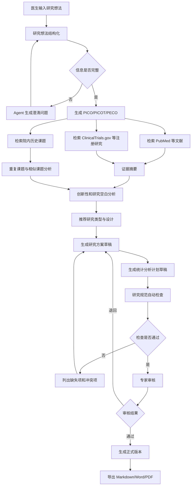
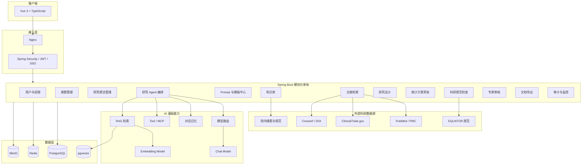
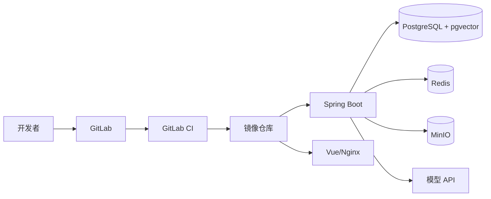

# 医疗研究 Agent 完整开发框架

> 项目定位：面向医生和医学研究人员的科研辅助系统。医生输入初步想法，系统通过需求澄清、文献与临床试验检索、研究问题结构化、创新性分析、研究设计、统计方案草拟和规范检查，生成可供专家继续修改和审核的课题方案、研究方案及申报材料初稿。
>
> 本系统是**科研辅助工具**，不是临床诊断系统，也不能代替研究者、统计学专家、伦理委员会或科研管理部门作出最终判断。

---

# 1. 项目目标

## 1.1 核心目标

系统需要解决医生在科研立项初期的常见问题：

1. 只有一个临床想法，不知道如何转化为规范的研究问题。
2. 不确定选题是否已有大量同类研究。
3. 不知道应该采用队列研究、病例对照、横断面、随机对照试验还是系统综述。
4. 不熟悉 PICO、PICOT、PECO 等研究问题结构。
5. 不熟悉研究终点、纳入排除标准、变量定义和统计分析方案。
6. 不熟悉 CONSORT、SPIRIT、STROBE、PRISMA、STARD、TRIPOD 等研究规范。
7. 文献检索、临床试验检索和研究方案撰写耗时较长。
8. 生成内容缺乏可追溯引用，难以确认依据。
9. 课题材料在不同版本之间修改混乱，无法有效协作和审核。

系统最终应实现：

```text
医生输入研究想法
        ↓
Agent 追问关键研究信息
        ↓
形成结构化研究问题
        ↓
检索文献、指南和临床试验
        ↓
分析研究空白、创新性和可行性
        ↓
推荐研究设计
        ↓
生成课题名称、立项依据和研究方案
        ↓
生成变量、终点和统计分析计划草案
        ↓
按研究规范自动检查
        ↓
专家修改和审核
        ↓
导出课题申报书或研究方案
```

## 1.2 第一阶段支持的研究类型

建议第一阶段只支持以下五类，避免一开始做成无法控制的“万能科研 Agent”。

| 研究类型 | 典型用途 | 主要规范 |
|---|---|---|
| 横断面研究 | 描述患病率、现状、影响因素 | STROBE |
| 回顾性/前瞻性队列研究 | 暴露与结局、预后因素 | STROBE |
| 病例对照研究 | 探索疾病或不良结局的危险因素 | STROBE |
| 系统综述与 Meta 分析 | 汇总已有研究证据 | PRISMA、PRISMA-P |
| 诊断准确性研究 | 评价诊断指标、检查或模型 | STARD |

第二阶段再扩展：

- 随机对照试验：SPIRIT、CONSORT。
- 临床预测模型：TRIPOD。
- 病例报告：CARE。
- 定性研究：COREQ、SRQR。
- 动物实验：ARRIVE。
- 医疗器械和真实世界研究。
- 多中心研究和注册研究。

## 1.3 明确不做的事情

第一版不应直接完成以下高风险操作：

- 自动提交伦理审批。
- 自动注册临床试验。
- 自动注册 PROSPERO。
- 自动填写并提交基金申请系统。
- 自动给出最终样本量结论。
- 自动确定最终统计学方法。
- 自动判断研究符合伦理。
- 自动生成或伪造原始研究数据。
- 自动生成虚假文献、DOI、PMID 或引用。
- 自动将含身份信息的患者数据发送给外部模型。

所有正式研究方案必须经过：

```text
研究负责人审核
+
统计学专家审核
+
伦理和科研管理审核
```

---

# 2. 用户角色与权限模型

## 2.1 用户角色

| 角色 | 主要权限 |
|---|---|
| 医生/研究者 | 创建课题、输入研究想法、查看和编辑自己参与的课题 |
| 课题负责人 | 管理课题成员、确认研究方案、发起审核 |
| 科研秘书 | 管理课题流程、材料和版本 |
| 统计学专家 | 审核样本量、变量和统计分析计划 |
| 医学专家 | 审核医学背景、研究问题和临床可行性 |
| 伦理审核人员 | 查看伦理相关内容和风险说明 |
| 知识库管理员 | 上传、审核、发布科研规范和院内模板 |
| 系统管理员 | 用户、机构、角色、模型和系统配置 |
| 审计管理员 | 查看模型调用、工具调用、知识引用和操作审计 |

## 2.2 权限粒度

至少包括三层：

```text
功能权限
    例如：创建课题、导出方案、发布知识

数据权限
    例如：只能查看本人、本人所在科室或本人参与的课题

字段权限
    例如：患者数据、伦理材料、预算信息分别控制
```

建议使用：

```text
RBAC
+
课题成员关系
+
科室/机构数据权限
+
敏感字段权限
```

不要仅依靠前端隐藏按钮控制权限，后端必须再次校验。

---

# 3. 核心业务流程

## 3.1 课题生成主流程



## 3.2 研究想法澄清流程

医生可能只输入：

> 我发现糖尿病患者使用某类药物后肾功能变化比较明显，想做一个课题。

系统不能立即生成完整方案，应先澄清：

1. 研究对象是谁？
2. 研究场景是门诊、住院还是体检人群？
3. 计划研究哪一种药物或药物类别？
4. 主要观察的肾功能指标是什么？
5. 研究时间范围是什么？
6. 是否已有历史数据？
7. 可获取哪些实验室指标？
8. 是否有对照组？
9. 预期结局是什么？
10. 是探索关联、预测风险还是评估干预效果？

将回答转换成结构化对象：

```json
{
  "population": "2型糖尿病成年患者",
  "exposure": "某类降糖药物",
  "comparator": "未使用该类药物的患者",
  "outcome": "eGFR变化和急性肾损伤发生率",
  "time": "用药后12个月",
  "setting": "单中心住院与门诊数据库",
  "availableData": [
    "人口学信息",
    "用药记录",
    "肌酐",
    "eGFR",
    "合并症"
  ],
  "researchPurpose": "评价用药与肾功能变化的关联"
}
```

## 3.3 课题生成输出

Agent 最终输出不应只有一篇长文本，应同时提供结构化结果和可编辑文档。

### 结构化结果

```text
课题名称候选
研究类型
PICO/PICOT/PECO
核心研究问题
研究假设
研究背景
研究现状
研究空白
创新点
研究目标
主要终点
次要终点
研究对象
纳入标准
排除标准
暴露/干预
对照
变量定义
数据来源
偏倚与混杂因素
统计分析计划
样本量估算所需参数
伦理风险
数据管理方案
研究进度
预期成果
参考文献
规范检查结果
```

### 文档输出

支持生成：

- 课题立项摘要。
- 课题申报书初稿。
- 研究方案 Protocol。
- 文献综述初稿。
- 系统综述方案。
- 统计分析计划草案。
- 伦理申请材料辅助内容。
- 研究变量字典。
- 数据采集表 CRF 草案。
- 汇报 PPT 内容大纲。
- 研究进度计划。

---

# 4. 技术选型

## 4.1 推荐基础版本

考虑到你已有 Java 和 Spring Boot 经验，同时需要降低从 JDK 8 / Spring Boot 2.x 迁移的跨度，推荐生产基线：

```text
Java 21
Spring Boot 3.5.x
Spring AI 1.1.x
Vue 3
TypeScript
Vite
PostgreSQL 17+
pgvector 0.8.x
Redis
MinIO
```

当前 Spring Boot 3.5 系列要求 Java 17 及以上；Spring AI 1.1.x 能覆盖模型调用、结构化输出、RAG、工具调用、MCP 和可观测性。新项目可以使用 Java 21。

后续升级路线：

```text
Spring Boot 3.5 + Spring AI 1.1
        ↓
业务稳定、依赖完成验证
        ↓
Spring Boot 4.1 + Spring AI 2.0
```

不建议在第一版同时进行：

- Java 8 到 Java 21 迁移。
- Spring Boot 2 到 4 跨两代迁移。
- 全新 Agent 架构。
- 全新 MCP 架构。
- 微服务拆分。

## 4.2 前端技术栈

```text
Vue 3
TypeScript
Vite
Element Plus
Pinia
Vue Router
Axios
@vueuse/core
ECharts
markdown-it
Mermaid
PDF.js
Monaco Editor
SSE / Fetch Stream
```

### 前端主要职责

- 课题管理。
- 医生想法录入。
- Agent 对话和澄清问题。
- 研究流程进度展示。
- 文献列表与引用查看。
- 研究方案分章节编辑。
- 版本对比。
- 专家批注。
- 规范检查结果展示。
- 文件上传、预览和导出。
- 模型流式输出展示。

## 4.3 后端技术栈

```text
Java 21
Spring Boot 3.5.x
Spring MVC
Spring Security
Spring AI 1.1.x
MyBatis-Plus
HikariCP
Spring Validation
SpringDoc OpenAPI
Flyway
Resilience4j
Spring Boot Actuator
Micrometer
Prometheus
OpenTelemetry
```

建议使用 Spring MVC，而不是为了流式输出全面改用 WebFlux。

可以在特定接口返回：

```java
Flux<ServerSentEvent<AgentEvent>>
```

或使用 `SseEmitter` / 流式响应完成 Agent 输出。

## 4.4 数据存储

| 组件 | 用途 |
|---|---|
| PostgreSQL | 用户、课题、研究方案、文献元数据、版本、审核、审计 |
| pgvector | 文献摘要、指南、研究规范和院内课题的向量检索 |
| Redis | 会话、限流、短期 Agent 状态、任务进度、缓存 |
| MinIO | PDF、Word、课题附件、导出文件、文献全文 |
| OpenSearch（后期） | 大规模关键词检索和混合检索 |
| ClickHouse（后期） | 大规模模型调用和行为分析日志 |

第一版不建议同时引入过多基础设施：

```text
PostgreSQL + pgvector + Redis + MinIO
```

已经足够。

## 4.5 文档解析

推荐 Java 侧：

```text
Apache Tika
Apache PDFBox
Apache POI
jsoup
```

复杂扫描件或表格识别再增加独立 AI 服务：

```text
Python + FastAPI
OCR
版面分析
表格结构识别
参考文献解析
```

Java 后端负责业务和权限，Python 服务只负责算法。

---

# 5. 总体系统架构



---

# 6. 模块化单体项目结构

第一版推荐模块化单体，而不是微服务。

```text
medical-research-agent
├── medical-research-common
│   ├── 通用返回对象
│   ├── 异常体系
│   ├── 工具类
│   ├── 枚举
│   └── 基础 DTO
│
├── medical-research-framework
│   ├── Spring Security
│   ├── JWT / SSO
│   ├── 数据权限
│   ├── 操作日志
│   ├── Web 配置
│   ├── Jackson 配置
│   └── MyBatis-Plus 配置
│
├── medical-research-user
│   ├── 用户
│   ├── 机构
│   ├── 科室
│   ├── 角色
│   └── 权限
│
├── medical-research-project
│   ├── 课题
│   ├── 课题成员
│   ├── 研究想法
│   ├── 任务
│   ├── 里程碑
│   └── 课题状态机
│
├── medical-research-literature
│   ├── PubMed 检索
│   ├── 临床试验检索
│   ├── DOI 和文献元数据
│   ├── 文献去重
│   ├── 文献筛选
│   └── 文献证据表
│
├── medical-research-knowledge
│   ├── 知识库
│   ├── 文档解析
│   ├── 文档切片
│   ├── Embedding
│   ├── pgvector
│   ├── 混合检索
│   └── 引用管理
│
├── medical-research-agent
│   ├── Agent 编排
│   ├── 模型路由
│   ├── Prompt 管理
│   ├── 对话记忆
│   ├── 工具调用
│   ├── 结构化输出
│   ├── 任务执行
│   └── Agent 事件流
│
├── medical-research-design
│   ├── PICO/PICOT/PECO
│   ├── 研究类型推荐
│   ├── 研究目标
│   ├── 研究终点
│   ├── 纳排标准
│   ├── 变量字典
│   ├── 偏倚与混杂
│   └── 数据采集设计
│
├── medical-research-statistics
│   ├── 统计分析计划草拟
│   ├── 样本量参数收集
│   ├── 统计方法规则
│   ├── 缺失数据策略
│   └── 统计专家审核
│
├── medical-research-quality
│   ├── STROBE 检查
│   ├── PRISMA 检查
│   ├── STARD 检查
│   ├── SPIRIT 检查
│   ├── CONSORT 检查
│   ├── 引用真实性检查
│   └── 研究一致性检查
│
├── medical-research-review
│   ├── 专家审核
│   ├── 批注
│   ├── 退回修改
│   ├── 版本确认
│   └── 审核记录
│
├── medical-research-document
│   ├── 模板管理
│   ├── Markdown 生成
│   ├── Word 导出
│   ├── PDF 导出
│   └── 版本对比
│
├── medical-research-audit
│   ├── 模型调用日志
│   ├── 工具调用日志
│   ├── RAG 引用日志
│   ├── 操作审计
│   └── 质量评测
│
├── medical-research-integrate
│   ├── PubMed Client
│   ├── ClinicalTrials Client
│   ├── Crossref Client
│   ├── MCP Client
│   ├── 院内系统接口
│   └── 外部模型接口
│
└── medical-research-server
    └── 唯一启动模块
```

---

# 7. Agent 逻辑角色设计

第一版可以表现为一个“医疗研究 Agent”，内部使用多个逻辑角色协作，但不需要拆成多个服务。

| 逻辑角色 | 主要职责 |
|---|---|
| Research Intake Agent | 理解医生想法并提取研究要素 |
| Clarification Agent | 生成必要的澄清问题 |
| Question Formulation Agent | 形成 PICO/PICOT/PECO 和研究假设 |
| Evidence Search Agent | 生成检索式并调用文献工具 |
| Novelty Agent | 分析重复研究、研究空白和创新性 |
| Study Design Agent | 推荐研究类型、对照和随访设计 |
| Statistics Draft Agent | 草拟统计分析方案和样本量所需参数 |
| Protocol Writer Agent | 按模板生成研究方案 |
| Quality Reviewer Agent | 按规范检查完整性与一致性 |
| Citation Validator Agent | 验证 PMID、DOI、标题和作者是否匹配 |
| Final Review Agent | 汇总问题，生成供专家审核的最终草稿 |

这些角色是代码中的策略和 Prompt，不是微服务。

---

# 8. Agent 编排流程

## 8.1 状态定义

建议用业务任务表和应用层状态机管理，不依赖一次模型调用完成全部任务。

```text
DRAFT
CLARIFYING
QUESTION_CONFIRMED
SEARCHING_EVIDENCE
ANALYZING_NOVELTY
DESIGNING_STUDY
DRAFTING_PROTOCOL
QUALITY_CHECKING
WAITING_EXPERT_REVIEW
REVISION_REQUIRED
APPROVED
ARCHIVED
FAILED
```

## 8.2 任务步骤

```text
STEP_01_PARSE_IDEA
STEP_02_ASK_CLARIFICATION
STEP_03_BUILD_RESEARCH_QUESTION
STEP_04_BUILD_SEARCH_STRATEGY
STEP_05_SEARCH_LITERATURE
STEP_06_SEARCH_CLINICAL_TRIALS
STEP_07_SEARCH_INTERNAL_PROJECTS
STEP_08_ANALYZE_NOVELTY
STEP_09_SELECT_STUDY_DESIGN
STEP_10_GENERATE_PROTOCOL
STEP_11_GENERATE_STATISTICAL_PLAN
STEP_12_VALIDATE_CITATIONS
STEP_13_CHECK_REPORTING_GUIDELINE
STEP_14_EXPERT_REVIEW
STEP_15_EXPORT_DOCUMENT
```

每一步均应保存：

```text
输入
输出
模型
Prompt 版本
知识引用
工具调用
执行状态
错误信息
开始时间
结束时间
是否需要人工确认
```

## 8.3 为什么不能一次性调用大模型

一次大模型调用完成全部工作会导致：

- 无法确认文献是否真实。
- 无法独立重试失败步骤。
- 无法插入医生确认。
- 无法保留每一步依据。
- 无法根据研究类型选择不同规范。
- Prompt 太长，输出不稳定。
- 难以进行质量评测。
- 难以定位错误来自检索、推理还是写作。

因此必须采用：

```text
可持久化的多步骤工作流
+
每个关键节点人工确认
```

---

# 9. 模型路由设计

## 9.1 逻辑模型

```java
public enum MedicalResearchModelType {
    MEDICAL_FAST,
    MEDICAL_STANDARD,
    MEDICAL_REASONING,
    MEDICAL_REVIEW,
    MEDICAL_EMBEDDING,
    MEDICAL_OCR
}
```

| 逻辑模型 | 用途 |
|---|---|
| MEDICAL_FAST | 意图识别、分类、关键词提取、标题生成 |
| MEDICAL_STANDARD | 普通写作、文献摘要、结构化提取 |
| MEDICAL_REASONING | 研究设计、创新性分析、复杂方案生成 |
| MEDICAL_REVIEW | 独立复核、矛盾检查、引用检查 |
| MEDICAL_EMBEDDING | 文献和知识切片向量化 |
| MEDICAL_OCR | 扫描材料和图片文字识别 |

## 9.2 模型路由原则

```text
80% 简单任务
    → MEDICAL_FAST / MEDICAL_STANDARD

15% 复杂研究设计
    → MEDICAL_REASONING

5% 高风险或最终复核
    → MEDICAL_REVIEW
```

不能让前端直接传真实模型名称、Base URL 或 API Key。

配置示例：

```yaml
medical:
  research:
    ai:
      models:
        fast:
          provider: qwen
          model: ${MEDICAL_FAST_MODEL}
        standard:
          provider: qwen
          model: ${MEDICAL_STANDARD_MODEL}
        reasoning:
          provider: qwen
          model: ${MEDICAL_REASONING_MODEL}
        review:
          provider: second-provider
          model: ${MEDICAL_REVIEW_MODEL}
        embedding:
          provider: qwen
          model: ${MEDICAL_EMBEDDING_MODEL}
```

---

# 10. Spring AI 设计

## 10.1 ChatClient 配置

```java
@Configuration
public class ResearchAiConfiguration {

    @Bean
    public ChatMemory researchChatMemory() {
        return MessageWindowChatMemory.builder()
                .maxMessages(20)
                .build();
    }

    @Bean
    public ChatClient researchChatClient(
            ChatClient.Builder builder,
            ChatMemory researchChatMemory) {

        return builder
                .defaultSystem("""
                    你是医疗研究辅助智能体。

                    基本要求：
                    1. 只帮助形成研究课题和研究方案草案。
                    2. 不提供针对具体患者的临床诊断和治疗决定。
                    3. 不得生成不存在的文献、PMID、DOI或试验注册号。
                    4. 所有文献必须来自工具检索结果。
                    5. 缺少关键研究信息时必须提问，不得自行假设。
                    6. 统计学方案仅作为草案，必须提示统计学专家审核。
                    7. 伦理相关内容仅作为提示，不能代替伦理审查。
                    8. 清楚区分事实、推断、建议和待确认信息。
                    """)
                .defaultAdvisors(
                    MessageChatMemoryAdvisor.builder(researchChatMemory).build()
                )
                .build();
    }
}
```

## 10.2 结构化输出

研究想法解析对象：

```java
public record ResearchIdeaProfile(
        String specialty,
        String clinicalProblem,
        String population,
        String exposureOrIntervention,
        String comparator,
        String outcome,
        String timeFrame,
        String setting,
        String researchPurpose,
        List<String> availableData,
        List<String> missingInformation,
        double completenessScore
) {
}
```

课题方案对象：

```java
public record ResearchProtocolDraft(
        List<String> candidateTitles,
        String studyType,
        String researchQuestion,
        String hypothesis,
        PicoDefinition pico,
        String background,
        String researchGap,
        List<String> objectives,
        List<String> primaryOutcomes,
        List<String> secondaryOutcomes,
        List<String> inclusionCriteria,
        List<String> exclusionCriteria,
        List<VariableDefinition> variables,
        String statisticalPlan,
        List<String> biasRisks,
        List<String> ethicalConsiderations,
        List<CitationReference> references,
        List<String> issuesToConfirm
) {
}
```

所有结构化输出必须进行 Java 业务校验，不能直接信任模型结果。

---

# 11. Prompt 管理

## 11.1 Prompt 分类

```text
RESEARCH_IDEA_PARSE
RESEARCH_CLARIFICATION
PICO_GENERATION
SEARCH_QUERY_GENERATION
LITERATURE_SUMMARY
NOVELTY_ANALYSIS
STUDY_DESIGN_RECOMMENDATION
PROTOCOL_SECTION_GENERATION
STATISTICAL_PLAN_DRAFT
CITATION_VALIDATION
STROBE_CHECK
PRISMA_CHECK
STARD_CHECK
FINAL_REVIEW
```

## 11.2 Prompt 版本表

```text
ai_prompt_template
├── id
├── prompt_code
├── prompt_name
├── version
├── system_template
├── user_template
├── output_schema
├── model_type
├── temperature
├── status
├── created_by
├── reviewed_by
├── published_at
└── change_description
```

要求：

- Prompt 不散落在 Controller 和 Service 中。
- 发布后的 Prompt 不直接覆盖。
- 每次调用记录 Prompt 版本。
- Prompt 修改需要测试集回归。
- 正式 Prompt 需要专家审核。

---

# 12. 文献和研究数据源

## 12.1 第一阶段数据源

| 数据源 | 用途 | 集成方式 |
|---|---|---|
| PubMed | 生物医学文献检索 | NCBI E-utilities |
| PubMed Central | 开放全文 | PMC API/开放数据 |
| ClinicalTrials.gov | 临床试验和研究注册检索 | REST API |
| Crossref | DOI 和出版信息验证 | REST API |
| EQUATOR Network | 研究报告规范目录 | 审核后知识入库 |
| PROSPERO | 系统综述注册查询 | 搜索或受控人工查询 |
| 院内历史课题 | 重复课题检查 | 自建数据库 |
| 院内科研模板 | 方案和申报书生成 | 自建知识库 |

国内扩展：

- 中国临床试验注册中心。
- 国家药监局药物临床试验登记平台。
- 国家卫生健康委员会发布文件。
- 中华医学会指南和专家共识。
- 医院内部伦理、科研和数据管理制度。
- 经授权的 CNKI、万方、维普等资源。

注意：

> 商业数据库、付费论文和学会指南必须确认授权，不能默认批量下载、存储全文或向量化。

## 12.2 文献检索工具

建议通过 Java Tool 或自建 MCP 网关提供：

```text
search_pubmed
fetch_pubmed_details
fetch_pmc_full_text
search_clinical_trials
get_clinical_trial
verify_doi
search_internal_projects
search_reporting_guidelines
```

示例：

```java
@Component
public class PubMedTools {

    @Tool(description = """
        根据结构化检索式查询 PubMed。
        返回真实 PMID、标题、作者、摘要、期刊和发表时间。
        不得由模型自行生成 PMID。
        """)
    public PubMedSearchResult searchPubMed(
            @ToolParam(description = "PubMed 检索式")
            String query,
            @ToolParam(description = "最大返回数量，1到100")
            Integer limit) {

        int safeLimit = Math.min(Math.max(limit, 1), 100);
        return pubMedClient.search(query, safeLimit);
    }
}
```

---

# 13. 文献检索与引用真实性

## 13.1 检索流程


## 13.2 文献记录要求

每一条引用至少保存：

```text
PMID
DOI
标题
作者
期刊
发表日期
摘要
文献类型
来源数据库
检索式
检索时间
原始 API 响应哈希
是否已验证
```

## 13.3 禁止模型直接编造引用

文献只能来自：

```text
工具返回结果
+
数据库中已保存并验证的文献
```

生成正文时，模型只能引用分配的引用编号，例如：

```text
[CIT-001]
[CIT-002]
```

文档生成完成后，再由后端替换为标准引用格式。

## 13.4 引用校验

校验内容：

- PMID 是否存在。
- PMID 对应标题是否一致。
- DOI 是否存在。
- DOI、标题和期刊是否一致。
- 文献结论是否支持正文表述。
- 是否将动物研究误写成人体研究。
- 是否将观察性研究误写成随机对照试验。
- 是否错误理解统计关联为因果关系。

---

# 14. RAG 知识库设计

## 14.1 知识库分类

```text
科研方法学知识库
研究报告规范知识库
统计学知识库
伦理与数据管理知识库
院内科研制度知识库
课题申报模板知识库
专业医学指南知识库
院内历史课题知识库
```

## 14.2 文档状态

```text
DRAFT
PENDING_REVIEW
PUBLISHED
EXPIRED
REVOKED
```

只有 `PUBLISHED` 状态可用于正式生成。

## 14.3 Metadata

```json
{
  "documentId": "DOC-001",
  "documentType": "REPORTING_GUIDELINE",
  "guidelineCode": "STROBE",
  "version": "CURRENT",
  "sourceOrganization": "EQUATOR",
  "effectiveDate": "2026-01-01",
  "status": "PUBLISHED",
  "language": "zh-CN",
  "sectionTitle": "Study Design",
  "pageNumber": 3,
  "securityLevel": "PUBLIC",
  "hospitalId": null
}
```

## 14.4 混合检索

推荐：

```text
关键词检索
+
向量检索
+
Metadata 过滤
+
重排序
```

第一版可以使用：

```text
PostgreSQL 全文检索
+
pgvector HNSW
```

知识量和并发明显增长后，再评估 OpenSearch。

---

# 15. 研究类型推荐规则

研究设计不能完全由大模型自由判断，应使用：

```text
规则引擎
+
模型辅助解释
+
人工确认
```

示例规则：

```text
研究目标为描述患病率或现状
    → 横断面研究

已知暴露，观察后续结局
    → 队列研究

从结局出发回顾暴露
    → 病例对照研究

评价诊断检查准确性
    → 诊断准确性研究

汇总已有研究证据
    → 系统综述/Meta 分析

评价干预效果且能够随机分组
    → 随机对照试验候选
```

模型负责：

- 解释为什么推荐。
- 给出备选设计。
- 说明各设计优缺点。
- 提示所需数据和资源。

最终由研究负责人确认研究类型。

---

# 16. 统计分析模块

## 16.1 定位

该模块只生成：

> 统计分析计划草案和需要统计学专家确认的参数清单。

不应直接承诺统计方法一定正确。

## 16.2 输出内容

- 描述性统计。
- 主要终点分析。
- 次要终点分析。
- 暴露和结局变量类型。
- 协变量。
- 潜在混杂因素。
- 分层分析。
- 亚组分析。
- 敏感性分析。
- 缺失数据处理。
- 多重比较。
- 模型诊断。
- 效应量和置信区间。
- 样本量估算所需参数。
- 推荐统计软件。
- 待统计专家确认项。

## 16.3 样本量流程

```text
Agent 判断研究类型
        ↓
列出样本量估算必需参数
        ↓
用户或文献提供预期效应量等参数
        ↓
调用经过验证的计算函数
        ↓
生成计算过程与假设
        ↓
统计学专家审核
```

禁止仅让大模型在自然语言中“猜一个样本量”。

样本量工具必须是确定性函数，并记录：

- 公式。
- 参数。
- 显著性水平。
- 检验效能。
- 失访率。
- 软件或算法版本。
- 计算时间。

---

# 17. 科研规范检查

## 17.1 规范映射

| 研究类型 | 检查规范 |
|---|---|
| 随机对照试验方案 | SPIRIT |
| 随机对照试验报告 | CONSORT |
| 观察性研究 | STROBE |
| 系统综述方案 | PRISMA-P |
| 系统综述报告 | PRISMA |
| 诊断准确性研究 | STARD |
| 预测模型研究 | TRIPOD |
| 病例报告 | CARE |
| 定性研究 | COREQ / SRQR |
| 动物研究 | ARRIVE |

## 17.2 检查方式

将规范条目结构化：

```text
guideline
guideline_item
guideline_item_mapping
guideline_check_result
```

检查结果：

```json
{
  "guideline": "STROBE",
  "score": 78,
  "items": [
    {
      "itemCode": "STROBE-06",
      "status": "MISSING",
      "message": "未明确描述参与者纳入与排除标准",
      "suggestion": "补充研究对象来源、纳入标准和排除标准"
    }
  ]
}
```

大模型可以辅助判断文本是否覆盖条目，但最终结果必须标记为“自动预检查”。

---

# 18. 数据库设计

## 18.1 用户与权限

```text
sys_user
sys_org
sys_department
sys_role
sys_permission
sys_user_role
sys_role_permission
```

## 18.2 课题主表

### `research_project`

```text
id
project_code
project_name
specialty
study_type
research_stage
status
principal_investigator_id
department_id
hospital_id
current_version_id
confidentiality_level
created_by
created_at
updated_by
updated_at
is_deleted
```

### `research_project_member`

```text
id
project_id
user_id
member_role
data_scope
joined_at
status
```

### `research_idea`

```text
id
project_id
raw_idea
structured_idea_json
completeness_score
confirmed_by
confirmed_at
version
```

## 18.3 研究设计

### `research_question`

```text
id
project_id
question_type
population
intervention_or_exposure
comparator
outcome
time_frame
setting
research_question
hypothesis
confirmed_status
```

### `research_protocol`

```text
id
project_id
version_no
study_type
title
abstract_text
background
research_gap
objectives_json
design_json
participants_json
outcomes_json
variables_json
statistical_plan
ethical_considerations
data_management_plan
schedule_json
status
generated_by
reviewed_by
created_at
```

### `research_variable`

```text
id
project_id
variable_code
variable_name
variable_role
data_type
unit
source
definition
allowed_values_json
missing_value_rule
is_primary
```

## 18.4 文献

### `literature_record`

```text
id
pmid
pmcid
doi
title
abstract_text
authors_json
journal
publication_date
publication_type
source_database
verified_status
metadata_json
created_at
```

### `project_literature`

```text
id
project_id
literature_id
relation_type
relevance_score
evidence_level
screening_status
exclusion_reason
citation_order
```

### `literature_search_task`

```text
id
project_id
database_name
search_query
search_filters_json
search_time
result_count
task_status
raw_result_file_id
```

## 18.5 Agent

### `ai_conversation`

```text
id
project_id
user_id
conversation_type
title
status
created_at
```

### `ai_message`

```text
id
conversation_id
role
content
structured_content_json
model_call_id
created_at
```

### `ai_agent_task`

```text
id
project_id
task_type
current_step
status
input_json
output_json
retry_count
started_at
completed_at
error_code
error_message
```

### `ai_model_call_log`

```text
id
trace_id
project_id
conversation_id
user_id
agent_code
model_type
provider
model_name
prompt_code
prompt_version
input_token_count
output_token_count
duration_ms
status
error_code
input_hash
output_hash
created_at
```

### `ai_tool_call_log`

```text
id
model_call_id
tool_call_id
tool_name
input_summary
output_summary
permission_result
status
duration_ms
created_at
```

### `ai_rag_reference`

```text
id
model_call_id
document_id
chunk_id
literature_id
similarity_score
rerank_score
page_number
section_title
content_hash
```

## 18.6 审核与版本

```text
research_review_task
research_review_comment
research_document_version
research_change_record
research_export_record
```

---

# 19. API 设计

## 19.1 课题接口

```http
POST   /api/research/projects
GET    /api/research/projects
GET    /api/research/projects/{projectId}
PUT    /api/research/projects/{projectId}
POST   /api/research/projects/{projectId}/members
POST   /api/research/projects/{projectId}/submit-review
POST   /api/research/projects/{projectId}/archive
```

## 19.2 研究想法和 Agent

```http
POST   /api/research/projects/{projectId}/ideas
POST   /api/research/projects/{projectId}/agent/clarify
POST   /api/research/projects/{projectId}/agent/confirm-question
POST   /api/research/projects/{projectId}/agent/generate-protocol
GET    /api/research/projects/{projectId}/agent/tasks/{taskId}
GET    /api/research/projects/{projectId}/agent/tasks/{taskId}/stream
POST   /api/research/projects/{projectId}/agent/tasks/{taskId}/retry
```

## 19.3 文献

```http
POST   /api/research/projects/{projectId}/literature/search
GET    /api/research/projects/{projectId}/literature
POST   /api/research/projects/{projectId}/literature/{literatureId}/include
POST   /api/research/projects/{projectId}/literature/{literatureId}/exclude
POST   /api/research/literature/verify-citation
```

## 19.4 研究方案

```http
GET    /api/research/projects/{projectId}/protocol
PUT    /api/research/projects/{projectId}/protocol/sections/{sectionCode}
POST   /api/research/projects/{projectId}/protocol/regenerate-section
POST   /api/research/projects/{projectId}/protocol/quality-check
GET    /api/research/projects/{projectId}/protocol/versions
GET    /api/research/projects/{projectId}/protocol/compare
```

## 19.5 导出

```http
POST   /api/research/projects/{projectId}/exports/markdown
POST   /api/research/projects/{projectId}/exports/docx
POST   /api/research/projects/{projectId}/exports/pdf
GET    /api/research/exports/{exportId}/download
```

---

# 20. SSE 事件协议

Agent 执行过程不要只返回文本，推荐统一事件格式：

```json
{
  "eventId": "EVT-001",
  "taskId": "TASK-001",
  "eventType": "LITERATURE_SEARCHING",
  "stepCode": "STEP_05_SEARCH_LITERATURE",
  "message": "正在检索 PubMed 文献",
  "progress": 35,
  "data": {},
  "timestamp": "2026-07-26T10:00:00Z"
}
```

事件类型：

```text
TASK_STARTED
CLARIFICATION_REQUIRED
RESEARCH_QUESTION_GENERATED
LITERATURE_SEARCHING
LITERATURE_FOUND
TRIAL_SEARCHING
NOVELTY_ANALYZING
STUDY_DESIGNING
PROTOCOL_GENERATING
QUALITY_CHECKING
EXPERT_REVIEW_REQUIRED
TASK_COMPLETED
TASK_FAILED
```

前端根据事件展示流程，而不是展示模型的隐藏思考过程。

---

# 21. 前端页面设计

## 21.1 页面结构

```text
登录
工作台
课题列表
新建课题向导
课题详情
├── 基本信息
├── 研究想法
├── Agent 对话
├── PICO/研究问题
├── 文献检索
├── 相似课题
├── 研究设计
├── 研究方案
├── 统计分析
├── 规范检查
├── 专家审核
├── 版本记录
└── 导出中心

知识库管理
Prompt 管理
模型管理
科研规范管理
用户与权限
审计与监控
```

## 21.2 研究方案编辑器

建议采用分章节编辑，而不是一个大文本框：

```text
1. 课题名称
2. 摘要
3. 研究背景
4. 国内外研究现状
5. 研究空白
6. 研究目标
7. 研究假设
8. 研究设计
9. 研究对象
10. 纳入排除标准
11. 变量和终点
12. 数据收集
13. 统计分析
14. 偏倚控制
15. 伦理和数据安全
16. 研究进度
17. 预期成果
18. 参考文献
```

每个章节支持：

- 手工编辑。
- Agent 重新生成。
- 查看生成依据。
- 查看引用。
- 与上一版本对比。
- 专家批注。
- 锁定已确认章节。

---

# 22. 安全与合规

## 22.1 数据分类

```text
公开科研知识
院内科研制度
未公开课题材料
患者去标识化研究数据
患者身份信息
伦理与合同材料
```

不同等级使用不同权限、加密、日志和模型策略。

## 22.2 患者数据原则

第一版建议只处理：

```text
研究想法
聚合数据描述
去标识化变量说明
研究方案
```

不要将真实患者明细直接交给大模型。

后续确需分析真实数据时：

- 在院内环境部署。
- 先完成去标识化。
- 遵循最小必要原则。
- 限制模型供应商。
- 完整记录模型输入输出。
- 经过伦理和数据管理审批。
- 禁止模型持久化原始患者数据。

## 22.3 防 Prompt Injection

外部论文、上传文件和网页内容都属于不可信输入。

必须：

- 将外部文档标记为“检索材料”，不能作为系统指令。
- 禁止文档内容修改系统规则。
- 工具白名单。
- 工具参数校验。
- 外部 URL 白名单。
- 限制文件类型和大小。
- 扫描恶意文件。
- 防止模型通过文献内容请求泄露其他课题数据。

## 22.4 工具安全

- 只读科研工具可以自动调用。
- 写操作需要明确用户确认。
- 导出和提交需要权限校验。
- 外部 API Key 仅保存在后端。
- 工具调用必须带当前用户、项目和权限上下文。
- 所有写工具支持幂等。

---

# 23. 审计与可追溯

每一段最终生成内容应尽可能追溯到：

```text
医生输入
Prompt 版本
模型名称和版本
文献检索结果
知识库文档
工具调用
生成时间
人工修改记录
专家审核记录
```

研究方案正文中建议支持“依据面板”：

```text
本段由哪个模型生成
引用了哪些文献
使用了哪些知识片段
哪些内容是模型推断
哪些内容待专家确认
```

不得仅保存最终文档而丢失生成过程。

---

# 24. 质量评测体系

## 24.1 离线测试集

建立 100～300 个匿名科研场景：

- 内科研究想法。
- 外科研究想法。
- 药学研究想法。
- 检验研究想法。
- 影像研究想法。
- 护理研究想法。
- 系统综述。
- 诊断准确性研究。
- 回顾性队列。
- 课题信息严重缺失的场景。

## 24.2 评测指标

| 指标 | 含义 |
|---|---|
| 研究要素提取准确率 | PICO 等信息是否正确 |
| 关键问题追问覆盖率 | 是否询问缺失的必要信息 |
| 文献真实性 | PMID、DOI 是否真实 |
| 引用一致性 | 文献是否支持对应结论 |
| 检索相关率 | 检索结果与研究问题是否相关 |
| 重复课题识别率 | 是否发现相似院内和公开研究 |
| 研究设计合理率 | 推荐设计是否合理 |
| 结构化输出成功率 | JSON 是否符合 Schema |
| 规范条目覆盖率 | 是否覆盖对应报告规范 |
| 幻觉率 | 是否生成无依据事实 |
| 专家修改率 | 专家需要修改的内容比例 |
| 专家接受率 | 草稿是否可作为实际起点 |
| 响应时间 | 各步骤耗时 |
| 单课题成本 | 模型、检索和存储成本 |

LLM-as-a-Judge 可以作为辅助，不应代替医学专家和统计学专家评分。

---

# 25. 监控与告警

## 25.1 技术指标

```text
接口 QPS
接口错误率
P95/P99 延迟
数据库连接池
Redis 状态
外部 API 可用性
模型请求成功率
模型限流次数
模型超时次数
向量检索耗时
任务积压数量
```

## 25.2 AI 指标

```text
模型调用次数
输入/输出 Token
单任务成本
Prompt 版本
工具调用成功率
检索空结果率
引用校验失败率
结构化输出失败率
模型重试次数
人工退回率
```

## 25.3 告警

- PubMed API 连续失败。
- 模型连续超时。
- 引用校验失败率异常。
- 结构化输出失败率异常。
- 单课题 Token 成本超过阈值。
- Agent 任务长时间停留。
- 未经授权访问课题。
- 敏感数据检测命中。

---

# 26. 部署架构

## 26.1 开发和测试环境



## 26.2 生产环境

第一阶段可以采用：

```text
2 台应用节点
1 套 PostgreSQL 主备或云数据库
1 套 Redis
1 套 MinIO
1 台 Nginx / 负载均衡
```

正式环境要求：

- HTTPS。
- 数据库备份。
- MinIO 版本化和备份。
- 配置与密钥管理。
- 容器镜像扫描。
- 应用日志脱敏。
- 数据库最小权限。
- 网络访问白名单。
- 灾难恢复演练。
- 模型供应商切换能力。

---

# 27. CI/CD

## 27.1 后端流水线

```text
代码检查
→ 单元测试
→ 集成测试
→ 数据库迁移校验
→ 安全扫描
→ Maven 构建
→ Docker 镜像
→ 测试环境部署
→ Agent 回归测试
→ 人工审批
→ 生产部署
```

## 27.2 前端流水线

```text
pnpm install --frozen-lockfile
→ ESLint
→ vue-tsc
→ 单元测试
→ Vite build
→ Docker 镜像
→ 部署
```

## 27.3 Prompt 流水线

Prompt 也应进行版本化和测试：

```text
Prompt 修改
→ 结构化输出测试
→ 固定测试集回归
→ 幻觉与引用测试
→ 医学专家抽检
→ 发布
```

---

# 28. 测试策略

## 28.1 单元测试

- 研究类型规则。
- PICO 校验。
- 状态机。
- 权限。
- 引用格式。
- DOI/PMID 校验。
- 变量定义。
- 文档生成。
- 样本量确定性函数。

## 28.2 集成测试

建议使用 Testcontainers：

- PostgreSQL + pgvector。
- Redis。
- MinIO。
- 模拟模型服务。
- 模拟 PubMed API。
- 模拟 ClinicalTrials.gov API。

## 28.3 Agent 测试

- 固定输入是否返回合法 JSON。
- 缺少信息时是否追问。
- 是否生成虚假文献。
- 工具失败时是否正确降级。
- 无文献结果时是否明确说明。
- 模型输出含错误格式时能否修复或失败。
- Prompt Injection 测试。
- 越权工具调用测试。

## 28.4 验收测试

由以下人员共同参与：

```text
临床医生
科研管理人员
统计学专家
医学信息人员
开发和测试人员
```

---

# 29. 推荐开发阶段

## 阶段一：基础框架，2～3 周

- 用户、机构、角色和权限。
- 课题 CRUD。
- 课题成员。
- 研究想法录入。
- 文件存储。
- 基础审计。
- Vue 页面框架。

## 阶段二：基础 Agent，2～3 周

- 模型接入。
- 模型路由。
- Prompt 管理。
- 流式对话。
- 研究想法结构化。
- 澄清问题。
- PICO 生成。
- 结构化输出。

## 阶段三：文献和知识库，3～4 周

- PubMed 接口。
- ClinicalTrials.gov 接口。
- 文献去重。
- 文献元数据。
- 文献证据表。
- 院内知识库。
- Embedding 和 pgvector。
- 引用校验。

## 阶段四：研究方案，3～4 周

- 研究设计推荐。
- 研究方案分章节生成。
- 变量字典。
- 统计分析计划草案。
- 研究规范检查。
- 专家审核。
- 版本管理。

## 阶段五：导出与上线，2～3 周

- Markdown 导出。
- Word 导出。
- PDF 导出。
- 监控。
- 安全加固。
- 回归测试。
- 模型效果评测。
- 试运行。

第一版预计：

```text
12～17 周
```

具体取决于：

- 是否接入真实患者研究数据。
- 是否需要国产化部署。
- 是否需要私有模型。
- 是否接入 CNKI/万方等商业数据库。
- 是否需要复杂 Word 模板。
- 是否包含统计计算工具。

---

# 30. MVP 范围

第一版 MVP 建议只做：

1. 医生创建课题。
2. 输入研究想法。
3. Agent 生成澄清问题。
4. 生成 PICO 和研究问题。
5. 检索 PubMed。
6. 检索 ClinicalTrials.gov。
7. 分析相似研究与研究空白。
8. 推荐研究设计。
9. 生成观察性研究或系统综述方案。
10. 输出研究目标、纳排标准、终点和变量。
11. 生成统计分析计划草案。
12. 按 STROBE 或 PRISMA 自动检查。
13. 专家批注、退回和确认。
14. 导出 Markdown 和 Word。
15. 记录完整模型、文献和审核审计。

暂不做：

- 直接分析真实患者明细。
- 自动伦理提交。
- 自动临床试验注册。
- 复杂多中心协同。
- 自动基金系统填报。
- 自动论文投稿。
- 完整多 Agent 自主运行。

---

# 31. MVP 验收标准

## 功能验收

- 能从一句研究想法生成结构化研究信息。
- 关键信息缺失时能够追问。
- 能生成规范 PICO/PICOT/PECO。
- 能调用真实 PubMed API。
- 所有引用 PMID 均可验证。
- 能输出至少三种研究设计建议。
- 能生成结构化研究方案。
- 能按 STROBE 或 PRISMA 检查。
- 能保存和对比文档版本。
- 能完成专家审核。
- 能导出 Markdown 和 Word。

## 质量验收

- 不允许出现不存在的 PMID 和 DOI。
- 结构化输出成功率建议达到 98% 以上。
- 关键 Agent 任务失败后可重试。
- 所有正式内容可追溯到模型、Prompt 和引用。
- 越权用户不能查看课题。
- 日志不出现模型 API Key 和患者身份信息。
- 无文献支持时明确标记“证据不足”。

---

# 32. 推荐编码约束

1. 采用模块化单体，不拆微服务。
2. 只允许一个启动模块。
3. Controller 不直接调用 ChatClient。
4. 模型调用统一经过 `ModelRouter`。
5. Prompt 统一经过 `PromptService`。
6. 工具统一注册和鉴权。
7. Agent 每一步必须持久化。
8. 业务数据与模型上下文分开保存。
9. 文献引用必须来自工具结果。
10. 所有结构化输出必须进行 Java 校验。
11. 不允许在业务代码中硬编码模型名称。
12. 不允许将完整 Prompt 打入普通日志。
13. 不允许外部文档覆盖系统指令。
14. 不允许模型直接执行高风险写操作。
15. 数据库变更统一使用 Flyway。
16. API 统一返回和异常体系。
17. 关键写操作必须支持幂等。
18. 所有导出文档必须记录版本。
19. Agent 的重试必须设置上限。
20. 失败时优先返回可解释错误，不静默降级为编造结果。

---

# 33. 推荐核心接口抽象

```java
public interface ResearchAgentStep<I, O> {

    String stepCode();

    O execute(ResearchAgentContext context, I input);

    void validateInput(I input);

    void validateOutput(O output);
}
```

```java
public interface ModelRouter {

    ChatClient getChatClient(MedicalResearchModelType modelType);
}
```

```java
public interface ResearchTool {

    String toolCode();

    ToolRiskLevel riskLevel();

    ToolResult execute(ToolContext context, ToolRequest request);
}
```

```java
public interface CitationValidator {

    CitationValidationResult validate(CitationReference reference);
}
```

```java
public interface ReportingGuidelineChecker {

    String supportedGuideline();

    GuidelineCheckResult check(ResearchProtocolDraft protocol);
}
```

---

# 34. 关键设计结论

1. 系统定位为医疗科研辅助，而不是诊疗 Agent。
2. 主流程应围绕“想法澄清、证据检索、创新性、研究设计、方案生成和专家审核”展开。
3. Java 后端使用模块化单体，避免初期微服务化。
4. Vue 3 + TypeScript 负责工作台、文献、方案编辑和审核。
5. Spring AI 负责模型、Prompt、工具、RAG、结构化输出和 MCP。
6. Agent 任务必须分步骤持久化，不能依赖一次模型调用。
7. 所有文献必须来自真实工具检索并校验 PMID/DOI。
8. 研究规范应结构化为检查项，而不是只上传 PDF 给模型阅读。
9. 统计分析和样本量只能生成草案，必须由统计学专家审核。
10. 第一版优先支持观察性研究、系统综述和诊断研究。
11. 第一版使用 PostgreSQL + pgvector + Redis + MinIO 即可。
12. 对外部科研数据源建议通过自建 Java Tool 或 MCP 网关统一接入。
13. 最终方案必须保留模型、Prompt、文献、工具和人工修改的完整审计链。
14. 先完成一个可靠的单 Agent 多步骤流程，再考虑真正的多 Agent 协作。

---

# 35. 官方资料参考

- [Spring AI Reference](https://docs.spring.io/spring-ai/reference/)
- [Spring Boot 3.5 System Requirements](https://docs.spring.io/spring-boot/3.5/system-requirements.html)
- [Vue with TypeScript](https://vuejs.org/guide/typescript/overview)
- [Vue Tooling and Vite](https://vuejs.org/guide/scaling-up/tooling)
- [PubMed](https://pubmed.ncbi.nlm.nih.gov/)
- [NCBI E-utilities](https://www.ncbi.nlm.nih.gov/books/NBK25501/)
- [ClinicalTrials.gov API](https://clinicaltrials.gov/data-api/api)
- [EQUATOR Reporting Guidelines](https://www.equator-network.org/reporting-guidelines/)
- [CONSORT](https://www.equator-network.org/reporting-guidelines/consort/)
- [STROBE](https://www.equator-network.org/reporting-guidelines/strobe/)
- [PROSPERO](https://www.crd.york.ac.uk/prospero/)
- [WHO ICTRP](https://www.who.int/tools/clinical-trials-registry-platform)
- [NIH Clinical Trial Protocol Templates](https://grants.nih.gov/policy-and-compliance/policy-topics/clinical-trials/protocol-template)
- [pgvector](https://github.com/pgvector/pgvector)

---

# 36. 推荐的第一步

建议先实现一个最小闭环：

```text
医生输入想法
→ Agent 追问
→ 生成 PICO
→ PubMed 检索
→ 生成研究空白
→ 推荐研究设计
→ 生成观察性研究方案
→ STROBE 检查
→ 专家审核
→ 导出 Word
```

只要这个闭环能够稳定运行、引用真实、内容可追溯并且专家愿意使用，再继续扩展其他研究类型和复杂 Agent 能力。
