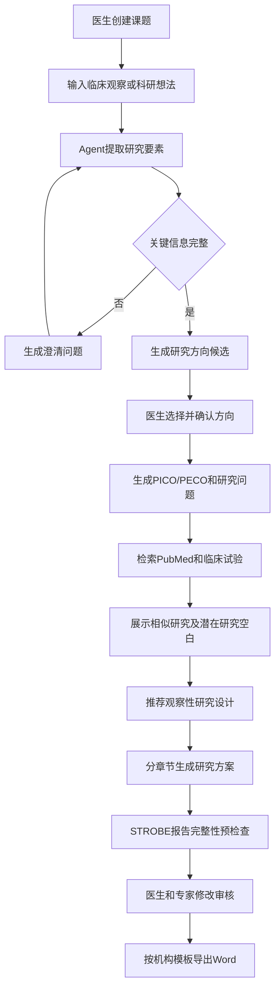
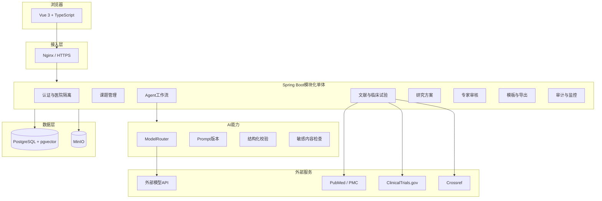
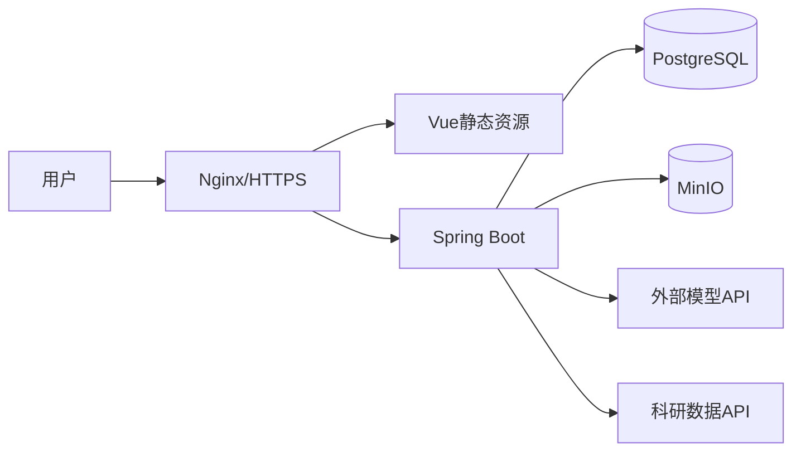

# 医疗研究 Agent 开发实施方案

> 文档版本：V1.0  
> 编制日期：2026-07-26  
> 项目阶段：实施准备  
> 适用范围：第一版 MVP、医院小范围试用及后续多医院演进  
> 关联文档：[医疗研究Agent完整开发框架.md](./医疗研究Agent完整开发框架.md)

---

# 1. 文档目的

本文档将总体架构方案收敛为可执行的开发计划，用于指导一名开发者完成需求、设计、前后端开发、测试、部署和试运行。

本文档重点解决：

1. 第一版到底做什么、不做什么。
2. 单人开发时如何拆分阶段和控制范围。
3. 每个阶段应交付什么、达到什么条件才能进入下一阶段。
4. 如何从第一天保留多医院隔离能力。
5. 如何在调用外部模型时控制患者敏感数据风险。
6. 如何保证文献、引用和生成内容可追溯。
7. 如何支持医院自定义 Word 模板和引用格式。
8. 如何从内部 MVP 演进到医院试用版本。

本文档是第一版开发的执行基线。开发过程中如需改变首版范围、数据边界或部署方式，应先更新本文档，再调整代码。

---

# 2. 已确认的项目决策

| 决策项 | 第一版决定 |
|---|---|
| 产品定位 | 面向医院医生的医疗科研辅助系统 |
| 核心价值 | 帮助医生形成研究方向，并生成观察性研究方案草案 |
| 首批用户 | 部分医院、约 100 名医生和专家 |
| 多医院能力 | 第一版即保留医院租户隔离，初期使用共享数据库和共享表 |
| 研究类型 | 横断面、队列、病例对照三类观察性研究 |
| 输出语言 | 中文 |
| 最终决定权 | 医生、医学专家、统计学专家和科研管理专家 |
| 模型 | 调用外部 API，通过统一模型路由接入，具体供应商后续确定 |
| 身份认证 | 平台自建账号体系，暂不接医院内部 SSO |
| 外部科研数据 | PubMed、ClinicalTrials.gov、Crossref；合法开放的 PMC 全文作为补充 |
| 商业数据库 | 第一版不接 CNKI、万方、维普 |
| 文档模板 | 支持医院上传受控的 `.docx` 模板并配置占位符 |
| 引用格式 | 每家机构自定义 |
| 开发数据库 | PostgreSQL，不以 H2 作为主开发数据库 |
| 文件存储 | MinIO，通过 S3 兼容接口封装 |
| 部署方式 | 普通 Linux、单应用节点、Nginx、PostgreSQL、MinIO |
| 开发团队 | 一人负责需求、开发、测试和部署 |
| 首批评测 | 开发前争取 5～10 个匿名案例；完成后使用 20～50 个匿名历史课题评测 |

---

# 3. 第一版产品范围

## 3.1 第一版核心闭环



## 3.2 第一版支持的研究类型

### 横断面研究

- 描述患病率、疾病分布或临床现状。
- 探索某时点的相关因素。
- 输出对象来源、时间范围、指标和分析建议。

### 队列研究

- 从暴露因素出发观察结局。
- 支持回顾性和前瞻性队列方案草拟。
- 输出随访时间、暴露定义、结局定义、潜在混杂因素和偏倚风险。

### 病例对照研究

- 从结局状态出发回顾暴露因素。
- 输出病例定义、对照选择、匹配因素、暴露测量和选择偏倚提示。

## 3.3 第一版输出内容

- 研究方向候选及选择依据。
- 建议研究类型及备选设计。
- PICO、PICOT 或 PECO。
- 核心研究问题和研究假设。
- 课题名称候选。
- 研究背景和立项依据草案。
- 检索范围内的相似研究。
- 潜在研究空白和创新点建议。
- 研究目标。
- 主要终点和次要终点。
- 研究对象及来源。
- 纳入标准和排除标准。
- 暴露、结局、协变量和混杂因素。
- 数据来源和变量字典草案。
- 偏倚控制建议。
- 统计分析计划草案。
- 样本量估算所需参数清单。
- 伦理和数据安全提示。
- STROBE 报告完整性预检查。
- 真实且可验证的参考文献。
- 可编辑研究方案。
- 机构自定义 Word 文档。

## 3.4 第一版明确不做

- 不生成临床诊断或治疗决策。
- 不分析真实患者明细数据。
- 不自动提交伦理审批。
- 不自动注册临床试验或研究。
- 不自动提交基金申报。
- 不自动生成或伪造研究数据。
- 不给出最终统计学结论。
- 不承诺研究方向绝对创新。
- 不承诺上传任意 Word 模板均可无损转换。
- 不接医院 HIS、EMR、LIS、科研平台或统一身份认证。
- 不接 CNKI、万方、维普。
- 不建设完整系统综述和 Meta 分析流程。
- 不建设多 Agent 自主协作平台。
- 不建设复杂 RAG 知识库。
- 不进行多节点和微服务部署。

---

# 4. 产品成功标准

## 4.1 产品价值标准

第一版成功不是以“模型能够生成长文章”为标准，而是满足：

1. 医生愿意用系统梳理初始想法。
2. 澄清问题能够帮助医生补全研究设计要素。
3. 研究方向和观察性研究设计可以作为专家讨论起点。
4. 生成的方案能被医生分章节修改，而不是只能复制整段文本。
5. 引用均可验证并能追溯到检索结果。
6. 专家可以明确看到模型建议、检索事实和待确认项。
7. 医院模板能够生成格式基本可用的 Word 文档。

## 4.2 第一版硬性质量门槛

| 指标 | 验收要求 |
|---|---|
| PMID、DOI 存在性 | 100% 可验证 |
| 引用来源 | 100% 来自工具检索或已验证数据库记录 |
| 患者数据外发 | 命中敏感规则的内容不得自动发送到外部模型 |
| 多医院隔离 | 用户不得读取其他医院的非公开数据 |
| 结构化输出 | 经过自动修复后成功率不低于 98% |
| 失败处理 | 不允许静默编造结果，必须返回可解释错误 |
| 任务恢复 | 应用重启后任务状态和已完成步骤不丢失 |
| 审计 | 正式生成内容可追溯到模型、Prompt、工具和引用 |
| 专家决策 | 所有研究方向、设计和统计内容明确标记为建议 |

## 4.3 专家评价指标

由医学、统计和科研管理专家按 1～5 分评价：

- 研究要素提取准确性。
- 澄清问题必要性。
- 研究方向可讨论性。
- 研究设计合理性。
- 终点和变量定义合理性。
- 统计分析草案可用性。
- 检索结果相关性。
- 引用对正文主张的支持程度。
- 专家修改工作量。
- 是否愿意在真实课题中继续使用。

STROBE 只用于检查报告内容是否覆盖对应条目，不计算“科研质量总分”。

---

# 5. 用户、角色与医院隔离

## 5.1 第一版角色

| 角色 | 权限 |
|---|---|
| 医生/研究者 | 创建课题、使用 Agent、编辑本人参与的课题 |
| 课题负责人 | 管理课题成员、确认研究方向、提交审核 |
| 专家 | 审核研究设计、统计内容和方案，添加批注 |
| 医院管理员 | 管理本院用户、模板、引用格式和数据策略 |
| 平台管理员 | 管理医院、模型、系统配置和运行状态 |
| 审计管理员 | 查看审计记录，不直接修改课题内容 |

小规模试用时，一个用户可以同时具有多个角色。

## 5.2 账号策略

- 第一版不开放自主注册。
- 账号由平台管理员或医院管理员创建。
- 用户首次登录必须修改初始密码。
- 支持禁用、解锁和重置密码。
- 连续登录失败触发临时锁定。
- 密码只保存强哈希，不可逆加密或明文。
- 登录、退出、失败、重置和禁用均记录审计。
- 第一版优先使用 HttpOnly、Secure、SameSite Cookie 管理会话。
- 对写接口启用 CSRF 防护或同等强度的请求校验。

## 5.3 多医院隔离原则

第一版采用共享数据库、共享表、`hospital_id` 字段隔离。

必须遵守：

1. 所有医院私有业务表包含 `hospital_id`。
2. `hospital_id` 从认证上下文获取，不信任前端提交值。
3. Service 和数据访问层统一注入医院条件。
4. 新增跨医院查询必须经过显式代码审查。
5. 对医院内唯一的数据建立 `(hospital_id, business_code)` 唯一索引。
6. 文件对象路径包含医院级不可猜测前缀。
7. 模型、模板、Prompt 和引用格式支持平台默认值与医院覆盖值。
8. 审计管理员跨院查询需要单独权限并记录原因。

后续医院数量和隔离要求提升后，再评估独立 Schema 或独立数据库。

---

# 6. 总体技术架构



## 6.1 第一版不使用 Redis 的条件

第一版单应用节点、约 100 用户时，Redis不是必需组件：

- 登录会话可使用数据库或单节点会话。
- Agent任务和步骤以 PostgreSQL 为事实源。
- SSE事件保存到数据库并由本节点推送。
- 短期缓存使用 Caffeine。

出现以下情况后再引入 Redis：

- 部署两个及以上应用节点。
- 需要跨节点 SSE 推送。
- 任务队列吞吐明显增长。
- 限流和缓存无法由单节点处理。
- 需要分布式锁或 Redis Streams。

## 6.2 异步任务原则

Agent工作流不得依赖一个 HTTP 请求从头执行到结束。

采用：

```text
创建任务
→ 返回taskId
→ 后台Worker分步骤执行
→ 每一步持久化
→ SSE推送事件
→ 浏览器断线后可重新查询和继续接收
```

第一版可以使用数据库任务表加应用内 Worker。任务领取使用状态、版本号和租约时间防止重复执行。

---

# 7. 技术选型基线

## 7.1 后端

```text
Java 21 LTS
Spring Boot 3.5.x（固定已验证补丁版本）
Spring AI 1.1.x（固定已验证补丁版本）
Spring MVC
Spring Security
MyBatis-Plus
Flyway
PostgreSQL JDBC
Spring Validation
SpringDoc OpenAPI
Resilience4j
Caffeine
Apache Tika
Apache PDFBox
Apache POI / 受控DOCX模板组件
Micrometer
Spring Boot Actuator
JUnit 5
Testcontainers
WireMock
ArchUnit
```

## 7.2 前端

```text
Vue 3
TypeScript
Vite
Element Plus
Pinia
Vue Router
Axios
@vueuse/core
markdown-it
ECharts
Vitest
Vue Test Utils
Playwright
ESLint
Prettier
```

## 7.3 数据和运行环境

```text
PostgreSQL 18
pgvector 0.8.x
MinIO / S3兼容对象存储
Docker Compose（本地开发）
Linux + Docker Compose（第一版部署）
Nginx
```

## 7.4 开发数据库原则

本地开发、集成测试和生产使用同一数据库类型：

```text
本地：Docker PostgreSQL + pgvector
集成测试：Testcontainers PostgreSQL + pgvector
生产：PostgreSQL + pgvector
```

H2不作为主开发数据库，不用于验证 JSONB、向量、索引、锁和生产SQL。

---

# 8. 工程结构

单人开发阶段采用“单后端工程、按业务能力分包”的模块化单体，暂不拆成多个 Maven 子模块。

```text
MEDICAL_AGENT
├── backend
│   ├── pom.xml
│   └── src
│       ├── main/java/.../medicalagent
│       │   ├── common
│       │   ├── infrastructure
│       │   ├── auth
│       │   ├── hospital
│       │   ├── user
│       │   ├── research
│       │   ├── agent
│       │   ├── literature
│       │   ├── protocol
│       │   ├── review
│       │   ├── template
│       │   ├── file
│       │   └── audit
│       └── main/resources
│           ├── db/migration
│           ├── prompts
│           └── application.yml
├── frontend
│   ├── package.json
│   └── src
│       ├── api
│       ├── components
│       ├── layouts
│       ├── router
│       ├── stores
│       ├── views
│       ├── modules
│       │   ├── auth
│       │   ├── research
│       │   ├── literature
│       │   ├── protocol
│       │   ├── review
│       │   └── admin
│       └── types
├── deploy
│   ├── docker-compose.dev.yml
│   ├── docker-compose.prod.yml
│   └── nginx
└── doc
```

使用 ArchUnit 或等价测试限制跨模块调用，Controller不得直接调用模型、文件存储或外部科研接口。

---

# 9. 核心数据模型

## 9.1 医院和用户

```text
hospital
platform_user
role
permission
user_role
hospital_user
login_audit
```

## 9.2 课题和研究想法

```text
research_project
research_project_member
research_idea
research_question
research_direction_candidate
research_direction_confirmation
```

## 9.3 Agent任务

```text
ai_agent_task
ai_agent_step_run
ai_agent_event
ai_conversation
ai_message
ai_prompt_template
ai_prompt_version
ai_model_call_log
ai_tool_call_log
```

`ai_agent_step_run` 至少保存：

```text
task_id
step_code
attempt_no
status
input_schema_version
output_schema_version
input_json
output_json
model_call_id
started_at
completed_at
error_code
error_message
requires_confirmation
confirmed_by
confirmed_at
version
```

## 9.4 文献和证据

```text
literature_search_task
literature_record
project_literature
research_claim
claim_citation_link
citation_validation_record
```

`research_claim` 表示方案正文中的一项事实性主张。  
`claim_citation_link` 记录文献是否支持该主张，并保存摘要或全文中的依据片段、位置和人工确认状态。

支持等级：

```text
SUPPORTED
PARTIALLY_SUPPORTED
NOT_SUPPORTED
ABSTRACT_ONLY
NEEDS_EXPERT_REVIEW
```

## 9.5 研究方案和版本

```text
research_protocol
research_protocol_section
research_protocol_section_version
research_variable
research_review_task
research_review_comment
research_change_record
```

研究方案必须按章节保存。每次手工编辑、Agent重生成和专家确认均形成新的章节版本。

## 9.6 模板、文件和引用格式

```text
file_object
document_template
document_template_version
template_field_definition
citation_style
export_task
export_record
```

所有文件对象保存：

- 医院。
- 上传人。
- 原始文件名和安全文件名。
- MIME类型和文件魔数识别结果。
- 文件大小。
- 哈希值。
- 存储桶和对象键。
- 敏感内容检测结果。
- 恶意文件扫描结果。
- 状态和删除时间。

---

# 10. Agent工作流设计

## 10.1 第一版步骤

```text
STEP_01_PARSE_IDEA
STEP_02_IDENTIFY_MISSING_INFORMATION
STEP_03_ASK_CLARIFICATION
STEP_04_GENERATE_RESEARCH_DIRECTIONS
STEP_05_CONFIRM_DIRECTION
STEP_06_BUILD_RESEARCH_QUESTION
STEP_07_BUILD_SEARCH_STRATEGY
STEP_08_SEARCH_PUBMED
STEP_09_SEARCH_CLINICAL_TRIALS
STEP_10_VALIDATE_LITERATURE
STEP_11_ANALYZE_SIMILAR_RESEARCH
STEP_12_RECOMMEND_OBSERVATIONAL_DESIGN
STEP_13_GENERATE_PROTOCOL_SECTIONS
STEP_14_GENERATE_STATISTICAL_DRAFT
STEP_15_VALIDATE_CLAIMS_AND_CITATIONS
STEP_16_CHECK_STROBE_COMPLETENESS
STEP_17_WAIT_EXPERT_REVIEW
STEP_18_EXPORT_DOCUMENT
```

## 10.2 人工确认点

必须暂停并由用户确认：

1. 研究想法结构化结果。
2. 研究方向选择。
3. 核心研究问题。
4. 研究类型。
5. 主要终点。
6. 进入正式方案生成。
7. 提交专家审核。
8. 生成正式导出版本。

## 10.3 模型职责和确定性职责

模型适合：

- 提取研究要素。
- 生成澄清问题。
- 提供多个研究方向。
- 解释研究设计选择。
- 生成检索概念和同义词建议。
- 摘要和组织检索到的证据。
- 生成方案草案。
- 检查文本是否覆盖报告条目。

后端确定性代码负责：

- 权限和医院隔离。
- 状态机。
- 必填字段和完整度规则。
- 工具参数限制。
- PMID和DOI存在性验证。
- 引用编号分配。
- 敏感信息检测和阻断。
- 任务幂等、重试和恢复。
- 文档版本和导出。
- 审计。

## 10.4 研究方向输出结构

每个研究方向至少包含：

```json
{
  "title": "方向名称",
  "researchPurpose": "研究目的",
  "recommendedStudyType": "RETROSPECTIVE_COHORT",
  "population": "研究人群",
  "exposure": "暴露因素",
  "outcome": "结局",
  "dataRequirements": [],
  "feasibilityConsiderations": [],
  "potentialValue": [],
  "limitations": [],
  "questionsToConfirm": []
}
```

不得输出“已证明创新”。统一使用：

> 基于当前检索数据库、检索式和检索日期，暂未发现高度相似研究；该结论不代表完成了全部数据库和灰色文献检索。

---

# 11. 模型接入与Prompt管理

## 11.1 模型接入原则

- 所有模型调用经过 `ModelRouter`。
- 前端不能传模型真实名称、Base URL或API Key。
- 模型供应商、模型和超时通过配置管理。
- 业务代码只使用逻辑模型类型。
- 第一版至少支持一个主模型和一个可选复核模型。
- 模型失败不得自动切换到未经批准的供应商。
- 模型输入在发送前执行敏感内容策略。
- 记录模型供应商、模型名、请求ID、Token、耗时和结果状态。
- 普通日志不记录完整Prompt、密钥和敏感内容。

## 11.2 逻辑模型

```text
RESEARCH_FAST
RESEARCH_STANDARD
RESEARCH_REASONING
RESEARCH_REVIEW
RESEARCH_EMBEDDING（预留，第一版不强依赖）
```

模型路由不预设固定调用百分比，由任务类型、风险、评测效果和成本共同决定。

## 11.3 Prompt版本

Prompt必须：

- 独立保存。
- 有稳定编码和版本。
- 有输入和输出Schema。
- 有状态：草稿、待审核、已发布、停用。
- 记录发布人和变更说明。
- 与测试案例绑定。
- 每次模型调用记录实际Prompt版本。

## 11.4 Chat Memory

- Chat Memory只用于当前对话上下文，不作为完整历史记录。
- 完整消息和任务过程保存到业务数据库。
- 每次调用显式传入隔离后的conversationId。
- conversationId至少包含医院和会话的不可猜测标识。
- 上下文按Token预算裁剪，并优先保留医生确认后的结构化事实。

---

# 12. 文献和临床试验集成

## 12.1 第一版数据源

| 数据源 | 用途 |
|---|---|
| PubMed | 医学文献检索和元数据 |
| PubMed Central | 合法开放全文补充 |
| ClinicalTrials.gov API v2 | 注册研究和相似试验检索 |
| Crossref | DOI和出版元数据验证 |

PubMed无需购买。API调用应配置 `tool`、`email` 和可选API Key，并实现限流、退避、批量获取和缓存。

## 12.2 检索记录

每次检索保存：

- 数据库。
- 原始研究问题。
- 结构化检索概念。
- 最终检索式。
- 筛选条件。
- 检索时间。
- 数据版本或时间戳。
- 返回数量。
- 纳入和排除记录。
- 原始响应文件哈希。
- 执行工具版本。

## 12.3 引用规则

1. 模型只能使用后端分配的引用编号。
2. PMID、DOI不得由模型自由生成。
3. 后端验证标题、作者、期刊、PMID和DOI映射。
4. 正文事实性主张关联到具体引用。
5. 只有摘要时标记为“摘要级证据”。
6. 无文献支持时明确标记“证据不足”或“待专家确认”。
7. 最终引用格式由机构配置转换，不能由模型随意拼接。

## 12.4 第一版已知限制

- PubMed不能覆盖全部中文医学研究。
- 不接CNKI、万方时，不能声称完成国内研究现状检索。
- 临床试验注册和论文发表不是同一证据来源。
- 相似研究检索结果用于辅助判断，不构成创新性证明。
- 系统不自动完成系统综述要求的双人筛选和多数据库检索。

---

# 13. 文件上传和敏感数据控制

## 13.1 第一版上传类型

| 类型 | 用途 |
|---|---|
| `.docx` | 医院模板、历史课题和研究材料 |
| `.pdf` | 可提取文本的研究材料 |
| `.txt`、`.md` | 纯文本资料 |

默认不支持Excel患者名单、影像DICOM、压缩包和可执行文件。

## 13.2 上传安全流水线

```text
用户选择文件
→ 前端风险提示与确认
→ 后端大小和扩展名检查
→ 文件魔数和MIME检查
→ 恶意文件扫描
→ 保存到隔离区
→ 文本提取
→ 敏感内容检测
→ 决定是否允许发送外部模型
→ 发布为可使用文件
```

## 13.3 敏感内容策略

第一版至少检测：

- 身份证号。
- 手机号。
- 银行账号。
- 住院号、门诊号和病案号模式。
- 地址和精确联系方式。
- 批量姓名加检验、诊断或用药记录。
- 明显的患者明细表格。

处理结果：

```text
SAFE
WARNING
BLOCKED_FOR_EXTERNAL_MODEL
REQUIRES_ADMIN_REVIEW
```

命中高风险规则的内容仍可按权限保存在医院项目内，但不得自动发送到外部模型。第一版默认不提供“用户自行忽略并继续外发”按钮。

## 13.4 外部模型上线前检查

在医院试用前确认：

- 供应商是否使用输入输出训练模型。
- 数据保存时间。
- 数据存储位置。
- 是否支持关闭日志或训练。
- 是否支持企业协议。
- 是否允许医疗科研场景。
- 是否有可用性和删除机制。
- 是否允许传输医院未公开课题内容。

未完成检查时，只允许使用匿名测试数据。

---

# 14. Word模板和机构引用格式

## 14.1 模板协议

第一版只支持受控 `.docx` 模板。模板通过占位符绑定字段：

```text
${project.title}
${project.principalInvestigator}
${project.department}
${research.background}
${research.question}
${research.objectives}
${research.studyDesign}
${research.population}
${research.inclusionCriteria}
${research.exclusionCriteria}
${research.outcomes}
${research.variables}
${research.statisticalPlan}
${research.ethicalConsiderations}
${research.references}
```

## 14.2 第一版支持能力

- 普通段落占位符。
- 表格单元格占位符。
- 简单列表。
- 简单重复区域。
- 图片或机构Logo占位符。
- 引用列表。
- 页眉页脚中的简单文本字段。
- 模板字段校验。
- 缺失字段提示。
- 模板版本。
- 生成预览和下载。

## 14.3 第一版不保证

- 宏。
- 任意文本框。
- 复杂Word域。
- 任意嵌套循环。
- 任意合并单元格自动扩展。
- 自动适配所有历史Word格式。
- PDF与Word像素级一致。

模板上传后必须经过验证和试生成，只有“已发布”版本可用于正式导出。

## 14.4 引用格式

机构引用格式配置至少包括：

- 文中引用形式：顺序编码、作者年份等。
- 作者显示规则。
- 作者人数截断。
- 期刊、年份、卷期、页码顺序。
- DOI和PMID是否显示。
- 中英文标点。
- 文献列表排序规则。

第一版可使用受控格式模板；后续再评估完整CSL兼容。

---

# 15. 主要API设计

## 15.1 认证和医院

```http
POST /api/auth/login
POST /api/auth/logout
GET  /api/auth/me
POST /api/auth/change-password

GET  /api/admin/hospitals
POST /api/admin/hospitals
GET  /api/hospital/users
POST /api/hospital/users
POST /api/hospital/users/{id}/disable
```

## 15.2 课题

```http
POST /api/research/projects
GET  /api/research/projects
GET  /api/research/projects/{projectId}
PUT  /api/research/projects/{projectId}
POST /api/research/projects/{projectId}/members
```

## 15.3 研究想法和Agent

```http
POST /api/research/projects/{projectId}/ideas
POST /api/research/projects/{projectId}/agent/tasks
GET  /api/research/projects/{projectId}/agent/tasks/{taskId}
GET  /api/research/projects/{projectId}/agent/tasks/{taskId}/events
GET  /api/research/projects/{projectId}/agent/tasks/{taskId}/stream
POST /api/research/projects/{projectId}/agent/tasks/{taskId}/confirm
POST /api/research/projects/{projectId}/agent/tasks/{taskId}/retry
POST /api/research/projects/{projectId}/agent/tasks/{taskId}/cancel
```

所有创建和重试接口支持幂等键。

## 15.4 文献

```http
POST /api/research/projects/{projectId}/literature/search
GET  /api/research/projects/{projectId}/literature
GET  /api/research/literature/{literatureId}
POST /api/research/literature/{literatureId}/verify
GET  /api/research/projects/{projectId}/claims
```

## 15.5 研究方案和审核

```http
GET  /api/research/projects/{projectId}/protocol
PUT  /api/research/projects/{projectId}/protocol/sections/{sectionCode}
POST /api/research/projects/{projectId}/protocol/sections/{sectionCode}/regenerate
GET  /api/research/projects/{projectId}/protocol/sections/{sectionCode}/versions
POST /api/research/projects/{projectId}/protocol/check-strobe
POST /api/research/projects/{projectId}/reviews
POST /api/research/reviews/{reviewId}/comments
POST /api/research/reviews/{reviewId}/approve
POST /api/research/reviews/{reviewId}/reject
```

## 15.6 模板和导出

```http
POST /api/hospital/templates
POST /api/hospital/templates/{templateId}/validate
POST /api/hospital/templates/{templateId}/publish
GET  /api/hospital/citation-styles
PUT  /api/hospital/citation-styles/{styleId}
POST /api/research/projects/{projectId}/exports
GET  /api/research/exports/{exportId}
GET  /api/research/exports/{exportId}/download
```

---

# 16. SSE事件和任务恢复

## 16.1 事件格式

```json
{
  "eventId": 1024,
  "taskId": "TASK-001",
  "eventType": "LITERATURE_SEARCH_COMPLETED",
  "stepCode": "STEP_08_SEARCH_PUBMED",
  "message": "PubMed检索完成，共获得46条结果",
  "progress": 45,
  "data": {},
  "timestamp": "2026-07-26T10:00:00Z"
}
```

## 16.2 恢复原则

- SSE只负责通知，不是任务事实源。
- 每个事件先入库，再推送。
- 前端保存最后一个eventId。
- 重连时携带 `Last-Event-ID` 或查询参数。
- 后端补发未接收事件。
- 定期发送心跳。
- 浏览器关闭不取消后台任务。
- 用户重新进入课题时可查看当前步骤和历史事件。

---

# 17. 前端页面

## 17.1 第一版业务页面

```text
登录
工作台
课题列表
新建课题
课题详情
├── 基本信息
├── 研究想法
├── Agent澄清
├── 研究方向
├── PICO/PECO
├── 文献和临床试验
├── 研究设计
├── 研究方案
├── STROBE预检查
├── 专家审核
├── 版本记录
└── 导出
```

## 17.2 管理页面

```text
医院管理
用户和角色
Word模板
引用格式
模型配置
Prompt版本
Agent任务
审计日志
系统运行状态
```

## 17.3 研究方案编辑器

- 按章节编辑。
- 自动保存。
- 乐观锁防止覆盖。
- Agent重新生成前展示影响范围。
- 支持查看上一版本。
- 展示每段引用和依据。
- 展示“模型建议、检索事实、人工内容、待确认项”标签。
- 专家批注锚定到章节版本。
- 已确认章节可锁定。

第一版不开发完整在线Office编辑器。

---

# 18. 安全和审计要求

## 18.1 基础安全

- HTTPS。
- 严格CORS。
- 安全Cookie。
- CSRF防护。
- 登录限速和失败锁定。
- 后端权限校验。
- 医院级数据隔离。
- 文件类型、大小和魔数检查。
- 恶意文件扫描。
- SQL参数化。
- 输出编码和富文本白名单。
- 外部URL白名单。
- API Key只保存在服务端密钥配置中。
- 日志脱敏。
- 依赖和容器镜像漏洞扫描。

## 18.2 Prompt Injection

- 上传文档和外部文献均标记为不可信数据。
- 文档内容不得覆盖系统规则。
- 工具调用使用白名单。
- 工具参数由后端Schema校验。
- 外部材料中的指令性文字不作为系统指令执行。
- RAG或文献内容不能请求读取其他课题或医院数据。
- 写操作不得由模型直接执行。

## 18.3 审计内容

- 登录和账号操作。
- 课题查看、编辑、导出和删除。
- 文件上传、检测和下载。
- 模型调用。
- Prompt版本。
- 工具调用。
- 文献检索和引用校验。
- Agent步骤和重试。
- 人工确认。
- 专家审核。
- 模板发布。
- 模型和系统配置修改。

审计记录应具备防普通用户修改能力，并配置保存期限。

---

# 19. 测试与评测

## 19.1 测试分层

### 单元测试

- 研究要素完整度规则。
- 观察性研究类型规则。
- 状态机。
- 医院数据过滤。
- 权限。
- PMID、DOI验证。
- 引用格式。
- 模板字段。
- 敏感内容规则。
- 任务重试和幂等。

### 集成测试

- PostgreSQL + pgvector。
- MinIO。
- Flyway迁移。
- 模型模拟服务。
- PubMed模拟服务。
- ClinicalTrials.gov模拟服务。
- Crossref模拟服务。
- 文件上传和导出。

### 前端测试

- 登录。
- 创建课题。
- 澄清问答。
- 研究方向确认。
- SSE重连。
- 章节编辑和版本。
- 专家审核。
- 模板上传和导出。

### 安全测试

- 跨医院读取。
- 越权编辑和导出。
- 文件伪装。
- Prompt Injection。
- 敏感数据外发阻断。
- 暴力登录。
- 重放和重复提交。
- 日志和错误信息泄密。

## 19.2 Agent评测数据

```text
开发集：5～10个匿名案例
验证集：10～20个匿名案例
试点评测集：20～50个未参与Prompt调试的匿名案例
```

评测记录必须保存：

- 输入案例版本。
- 模型和Prompt版本。
- 工具返回快照。
- 结构化输出。
- 专家评分。
- 专家修改意见。
- 成本和耗时。

模型升级和Prompt发布前必须执行固定回归集。

---

# 20. 本地开发与部署

## 20.1 本地开发

Docker Compose提供：

```text
PostgreSQL + pgvector
MinIO
可选的邮件模拟服务
可选的模型和外部API Mock
```

后端和前端可在IDE中运行，也可使用容器运行。

配置文件：

```text
application.yml                 公共默认配置
application-local.yml           本地非敏感配置
环境变量/外部密钥文件             API Key和密码
.env.example                    只保存变量名和示例，不保存真实密钥
```

## 20.2 第一版生产部署



最低要求：

- 域名和有效HTTPS证书。
- 数据库定时备份。
- MinIO版本化或定时备份。
- 配置和密钥不进入Git。
- 应用日志轮转。
- 操作系统时间同步。
- 防火墙仅开放必要端口。
- 数据库和MinIO不直接暴露公网。
- 备份恢复演练。
- 健康检查和磁盘告警。

## 20.3 代码仓库

正式代码提交前确认GitHub仓库是否私有。

无论仓库是否公开，禁止提交：

- 模型API Key。
- 数据库密码。
- 医院真实模板。
- 未公开课题材料。
- 患者或医生个人信息。
- 生产配置。
- 数据库备份。
- MinIO数据。

---

# 21. 分阶段实施计划

## 阶段0：需求收敛和技术验证，2周

### 目标

在建设管理功能前验证核心价值和关键技术风险。

### 开发任务

- 确认横断面、队列、病例对照的必填研究要素。
- 获取5～10个匿名历史课题作为开发集。
- 收集至少2套真实但已脱敏的Word模板。
- 定义Word占位符协议。
- 选择第一家外部模型供应商。
- 比较至少2个候选模型的中文结构化输出。
- 验证PubMed、ClinicalTrials.gov和Crossref接口。
- 验证DOCX模板填充和下载。
- 验证PDF和DOCX基础文本提取。
- 定义专家评分表。
- 确认代码仓库公开或私有策略。

### 交付物

- 产品范围清单。
- 研究要素Schema。
- 模型对比记录。
- 文献API验证代码或原型。
- Word模板原型。
- 专家评测表。
- 技术决策记录ADR。

### 阶段完成条件

- 至少一个模型可稳定输出研究想法结构化JSON。
- 至少一个真实模板可以成功填充。
- PubMed检索、详情获取和PMID验证可运行。
- 专家确认第一版研究流程合理。
- 患者数据边界和外部模型策略书面确认。

---

## 阶段1：工程基础和课题管理，3～4周

### 目标

建立可持续开发的基础工程和多医院数据边界。

### 开发任务

- 初始化Git仓库规范、分支和提交规则。
- 搭建Spring Boot和Vue工程。
- 配置PostgreSQL、pgvector、MinIO和Docker Compose。
- 建立Flyway迁移。
- 实现统一异常、返回结构、日志和Trace ID。
- 实现医院、用户、角色和权限。
- 实现管理员创建账号、登录、修改密码和禁用。
- 实现医院上下文和数据隔离。
- 实现课题CRUD和课题成员。
- 实现文件上传基础能力。
- 建立操作审计。
- 建立后端单元测试和集成测试基线。
- 建立前端布局、路由、状态和权限指令。

### 交付物

- 可登录系统。
- 可创建医院、用户和课题。
- 多医院基础隔离。
- PostgreSQL和MinIO开发环境。
- OpenAPI文档。
- 基础CI检查。

### 阶段完成条件

- 用户只能查看有权限的课题。
- 自动化测试证明跨医院查询被阻止。
- 数据库可从空库通过Flyway完整创建。
- 文件可安全上传到医院隔离路径。
- 日志中不出现密码和密钥。

---

## 阶段2：研究方向和观察性研究Agent，4～5周

### 目标

完成第一个有产品价值的Agent闭环。

### 开发任务

- 建立ModelRouter和逻辑模型配置。
- 建立Prompt模板和版本管理。
- 实现研究想法结构化。
- 实现按研究类型配置的必填字段规则。
- 实现澄清问题生成和多轮确认。
- 实现研究方向候选生成。
- 实现医生选择和确认方向。
- 实现PICO、PICOT、PECO生成。
- 实现观察性研究类型规则和模型解释。
- 建立Agent任务、步骤、事件和后台Worker。
- 实现任务重试、取消、超时和恢复。
- 实现SSE进度和断线补发。
- 保存完整对话和人工确认。

### 交付物

```text
一句研究想法
→ 结构化
→ 澄清
→ 多个研究方向
→ 医生确认
→ PICO/PECO
→ 观察性研究类型建议
```

### 阶段完成条件

- 5～10个开发案例均可完成流程。
- 缺失信息时不会直接生成完整方案。
- 任务失败可重试，应用重启后状态不丢失。
- 不同会话的模型上下文完全隔离。
- 专家认为研究方向可作为讨论起点。

### 内部MVP里程碑

完成本阶段后可以进行第一次医生演示，但不对外开放真实医院试用。

---

## 阶段3：文献、临床试验和引用证据链，3～4周

### 目标

让研究方向和研究背景建立在可验证的公开证据上。

### 开发任务

- 实现PubMed检索式生成和人工查看。
- 实现PubMed ESearch、ESummary/EFetch。
- 实现ClinicalTrials.gov API v2。
- 实现Crossref DOI验证。
- 实现文献去重。
- 保存检索式、日期、结果和原始响应哈希。
- 实现文献列表、纳入、排除和相关性标记。
- 实现PMID、标题、作者和DOI一致性验证。
- 建立research_claim和claim_citation_link。
- 实现摘要级证据标记。
- 生成相似研究和潜在研究空白建议。
- 在界面展示检索范围和数据源限制。
- 对外部API实现限流、超时、重试和缓存。

### 交付物

- 可复现的文献检索记录。
- 可验证文献列表。
- 相似研究摘要。
- 潜在研究空白建议。
- 主张与引用的依据面板。

### 阶段完成条件

- 不存在模型编造的PMID和DOI。
- 所有正文引用均能追溯到检索记录。
- 摘要证据和全文证据明确区分。
- PubMed失败时返回明确错误，不生成虚假结果。
- 页面明确提示未覆盖CNKI、万方等数据源。

---

## 阶段4：观察性研究方案和分章节编辑，4～5周

### 目标

生成可修改、可追溯的观察性研究方案草案。

### 开发任务

- 定义观察性研究方案章节Schema。
- 实现横断面、队列和病例对照模板。
- 实现分章节生成。
- 实现主要终点、次要终点和变量字典。
- 实现纳入和排除标准。
- 实现偏倚和混杂因素提示。
- 实现统计分析计划草案。
- 实现样本量所需参数清单，不自动猜测样本量。
- 实现章节自动保存和乐观锁。
- 实现章节版本和差异查看。
- 实现章节重新生成和影响确认。
- 实现引用插入和依据查看。
- 实现人工内容、模型内容和待确认项标签。

### 交付物

- 完整观察性研究方案草案。
- 分章节编辑器。
- 章节版本记录。
- 变量字典。
- 统计分析草案。

### 阶段完成条件

- 三类观察性研究使用不同规则和模板。
- 主要终点必须由医生确认。
- 每个事实性章节可查看引用。
- 手工修改不会被Agent静默覆盖。
- 所有正式内容都能追溯到生成和修改记录。

### 可用MVP里程碑

完成本阶段后形成内部可用MVP，可邀请少量医生使用匿名课题试用。

---

## 阶段5：STROBE预检查和专家审核，2～3周

### 目标

形成医生和专家共同确认的工作流。

### 开发任务

- 将STROBE条目结构化。
- 建立条目适用性规则。
- 实现覆盖、部分覆盖、缺失、不适用和待专家确认状态。
- 不生成误导性的总质量分。
- 实现专家审核任务。
- 实现章节批注、退回和通过。
- 实现课题负责人确认。
- 实现章节锁定。
- 实现审核历史和审计。

### 交付物

- STROBE报告完整性预检查。
- 专家批注和审核流程。
- 审核版本。

### 阶段完成条件

- 检查结果明确标记为自动预检查。
- 专家可对具体章节和版本批注。
- 审核通过后仍保留所有历史版本。
- 只有有权限的专家可以完成审核。

---

## 阶段6：Word模板、引用格式和导出，3～4周

### 目标

将审核后的方案输出为医院可继续使用的文档。

### 开发任务

- 实现模板上传、校验、试生成和发布。
- 实现受控占位符。
- 实现段落、表格、列表和简单重复区域。
- 实现医院级模板版本。
- 实现机构引用格式。
- 实现文中引用和参考文献列表。
- 实现Word导出任务。
- 实现导出记录、哈希和权限控制。
- 实现生成预览或基础格式检查。
- 准备至少2家医院模板的适配测试。

### 交付物

- 模板管理。
- 机构引用格式。
- Word导出。
- 导出审计。

### 阶段完成条件

- 两套真实模板可稳定生成。
- 缺失或未知占位符在发布前被发现。
- 导出文档中的引用与系统记录一致。
- 医院A的模板不能被医院B使用或读取。

---

## 阶段7：安全加固、评测、部署和试运行，3～4周

### 目标

达到小范围医院医生试用条件。

### 开发任务

- 完善敏感内容检测和外发阻断。
- 接入恶意文件扫描。
- 完成跨医院和越权测试。
- 完成Prompt Injection测试。
- 完成依赖和镜像安全扫描。
- 使用20～50个匿名历史课题评测。
- 收集医学、统计和科研管理专家评分。
- 修复高频质量问题。
- 配置Linux、Nginx、HTTPS、PostgreSQL和MinIO。
- 配置备份、日志、健康检查和告警。
- 制定试用账号、用户协议和问题反馈流程。
- 制定模型故障和外部API故障应急方案。

### 交付物

- 医院试用版本。
- 测试报告。
- Agent评测报告。
- 安全检查记录。
- 部署文档。
- 备份恢复文档。
- 用户手册和管理员手册。

### 阶段完成条件

- 所有硬性质量门槛通过。
- 无已知跨医院越权问题。
- 敏感内容阻断生效。
- 关键任务可恢复。
- 专家完成正式抽样验收。
- 备份和恢复演练成功。
- 模型供应商数据政策已确认。

---

# 22. 总体里程碑和时间

| 里程碑 | 包含阶段 | 预计时间 | 使用范围 |
|---|---|---:|---|
| 技术验证 | 阶段0 | 2周 | 开发者和专家 |
| 内部演示版 | 阶段1～2 | 累计9～11周 | 内部演示 |
| 可用MVP | 阶段3～4 | 累计16～20周 | 匿名课题、小范围内部试用 |
| 医院试用候选版 | 阶段5～6 | 累计21～27周 | 专家验收 |
| 医院试用版 | 阶段7 | 累计24～31周 | 部分医院、约100名用户 |

单人实施建议按 6～8 个月安排。时间不包含医院采购、正式等保测评、商业数据库采购和院内系统对接。

如果必须压缩到 3～4 个月，应删减：

- 专家在线审核。
- 复杂Word模板。
- 完整主张级证据面板。
- 医院自定义Prompt和模型。
- 高级版本对比。
- 多套引用格式。

但不得删减：

- 医院数据隔离。
- 文献真实性。
- 敏感内容外发阻断。
- 任务状态持久化。
- 权限和审计。

---

# 23. 版本发布门槛

## V0.1 技术原型

- 模型结构化输出。
- PubMed检索。
- 单套Word模板填充。
- 不部署给真实用户。

## V0.5 内部演示

- 登录和课题。
- 研究想法澄清。
- 研究方向和PICO。
- 观察性研究类型推荐。
- 仅匿名数据。

## V0.8 可用MVP

- 文献和临床试验。
- 研究方案生成。
- 分章节编辑。
- 引用可验证。
- 供内部医生试用。

## V0.9 医院试用候选版

- STROBE预检查。
- 专家审核。
- 机构模板和引用格式。
- 完成安全测试和专家验收。

## V1.0 医院试用版

- 敏感数据外发阻断。
- 部署、备份、监控和审计。
- 20～50案例评测通过。
- 只向已批准医院和白名单用户开放。

---

# 24. 主要风险和应对

| 风险 | 影响 | 应对措施 |
|---|---|---|
| 一人开发范围过大 | 延期、质量下降 | 严格按阶段交付，不同时开发后期功能 |
| 医生案例提供太晚 | Prompt无法验证 | 阶段0先获取5～10个匿名案例 |
| 外部模型政策不明确 | 医院数据风险 | 试用前完成供应商审查，匿名数据先行 |
| 医生上传患者资料 | 敏感数据外发 | 检测、阻断、审计，不只做文字提示 |
| 中文文献覆盖不足 | 创新性判断偏差 | 明确检索范围，后续采购商业数据库 |
| Word模板过于复杂 | 导出延期 | 使用受控占位符和模板验证，不承诺任意格式 |
| 文献真实但不支持结论 | 误导研究者 | 建立主张级引用、摘要级标记和专家确认 |
| Agent流程运行时间长 | 用户等待或中断 | 后台任务、步骤持久化、SSE和恢复 |
| 多医院越权 | 严重安全事件 | 统一医院上下文、自动化越权测试和审计 |
| 模型升级导致效果退化 | 输出不稳定 | 固定版本、Prompt版本、回归测试和灰度发布 |
| 本地H2与生产PG不一致 | 上线前集中失败 | 开发和测试从第一天使用PostgreSQL |
| GitHub公开仓库泄密 | 模板、密钥或材料泄露 | 仓库私有化或严格敏感文件治理 |

---

# 25. 开发编码原则

1. Controller不直接调用ChatClient。
2. 所有模型调用经过ModelRouter。
3. 所有外部科研接口经过独立Client和限流器。
4. 所有Agent步骤可单独重试和审计。
5. 每一步输入输出使用版本化Schema。
6. 医院隔离在后端强制执行。
7. 前端隐藏按钮不等于权限控制。
8. 业务历史和Chat Memory分开保存。
9. 引用必须来自工具检索。
10. 结构化输出必须经过Java校验。
11. 模型输出不得直接写入正式方案而不记录来源。
12. 用户手工内容不得被模型静默覆盖。
13. 高风险敏感内容不得自动发送外部模型。
14. Prompt和模型版本必须可追溯。
15. 数据库变更全部使用Flyway。
16. 关键写操作支持幂等和乐观锁。
17. 文件按医院隔离并验证实际类型。
18. API Key、密码和医院材料不得进入Git。
19. 失败时明确说明，不以编造结果降级。
20. 每个阶段先达到退出条件，再开始下一阶段。

---

# 26. 项目启动前最终检查清单

## 必须完成

- [ ] 确定代码仓库公开或私有策略。
- [ ] 确定第一家外部模型供应商。
- [ ] 确认模型数据保存和训练政策。
- [ ] 获取5～10个匿名开发案例。
- [ ] 获取至少2套脱敏Word模板。
- [ ] 确认受控模板占位符方案。
- [ ] 确认第一批医学、统计和科研管理专家。
- [ ] 确认敏感内容命中后默认阻断外发。
- [ ] 准备本地Docker环境。
- [ ] 确认Linux测试服务器和域名计划。

## 阶段0可继续确认

- [ ] 是否需要邮件找回密码。
- [ ] 第一批医院和用户创建流程。
- [ ] 机构引用格式样例。
- [ ] 外部模型成本上限。
- [ ] 审计日志保存期限。
- [ ] 文件保存和删除期限。
- [ ] 试用用户协议和隐私说明。

---

# 27. 推荐的第一项开发任务

不要先从完整用户管理或大量数据库表开始。

第一项技术任务应完成一个可验证的纵向原型：

```text
输入一句匿名研究想法
→ 输出结构化研究要素
→ 生成澄清问题
→ 生成三个观察性研究方向
→ 选择一个方向
→ 生成PICO/PECO
→ 调用PubMed获得真实文献
→ 生成带真实引用的研究背景片段
→ 填充到一份真实Word模板
```

该原型通过专家初步确认后，再正式进入阶段1的平台工程建设。

---

# 28. 最终实施结论

第一版应被定义为：

> 面向医院医生、以中文为主、支持多医院数据隔离的医疗科研辅助系统。系统帮助医生从临床观察形成研究方向，完成横断面、队列和病例对照研究的方案草案，并通过真实公开文献、分章节编辑、STROBE预检查、专家审核和机构Word模板形成可继续修改的研究材料。

第一版的竞争力不在于调用多少模型或拥有多少Agent，而在于：

1. 研究流程符合医生实际工作方式。
2. 文献和引用真实可追溯。
3. 生成内容可编辑、可审核、可导出。
4. 医院之间严格隔离。
5. 敏感数据不会未经控制发送到外部模型。
6. 单人开发仍能按阶段持续交付和验证。

完成可靠的观察性研究闭环并获得医生真实使用反馈后，再评估RAG知识库、中文商业数据库、系统综述、统计计算工具、医院SSO和多节点部署。
