# Medical Agent 系统详细架构设计

> 文档状态：与当前工作区实现同步
>
> 更新日期：2026-07-29（Asia/Shanghai）
>
> 当前阶段：阶段 7——安全、评测与部署基线
>
> 适用版本：后端 `0.1.0-SNAPSHOT`，数据库 Flyway V1～V19

## 1. 文档目的

本文描述当前代码实际采用的架构，不是未来愿景清单。目标是让开发、测试、安全、运维和审核人员
能够回答以下问题：

- 系统边界在哪里，哪些服务属于信任域内或信任域外。
- 前端、后端、数据库、对象存储和 ClamAV 如何协作。
- 18 步 Agent 为什么能够重试、恢复、人工确认和审计。
- 多医院隔离、认证、CSRF、文件安全和外部模型出站控制在哪里执行。
- 关键数据保存在哪些表和对象路径中。
- 哪些操作具有数据库事务，哪些跨存储操作使用补偿。
- 当前单节点设计的容量边界和未来演进触发条件是什么。

快速运行、环境变量和完整 API 清单见项目根目录 [README](../../README.md)。

## 2. 系统定位与边界

Medical Agent 是科研设计辅助系统，不是医疗器械或临床决策系统。它接收匿名研究想法，
生成和管理科研设计中间产物，并通过明确的人工确认点完成研究方案导出。

### 2.1 系统内职责

- 管理医院、用户、角色、会话、课题和课题成员。
- 管理上传文件的扫描、提取、敏感内容判定和隔离存储。
- 运行 18 步、可恢复的科研 Agent 工作流。
- 调用已配置的模型和公共科研数据源。
- 保存检索、验证、生成、审核和导出的完整证据链。
- 通过 SSE 通知浏览器任务变化。
- 使用受控 DOCX 模板和医院引用格式生成最终文档。

### 2.2 明确非目标

- 不接收或分析真实患者明细。
- 不输出诊断、治疗或用药建议。
- 不自动证明“研究创新性”。
- 不把 ClinicalTrials.gov 注册记录当作同行评议论文。
- 不猜测样本量参数或替代统计专家。
- 不允许用户绕过敏感内容外发门禁。
- 不支持任意 DOCX 宏、复杂 Word 域或任意模板脚本。
- 当前不提供多节点任务调度、分布式 SSE 或跨节点缓存一致性。

## 3. 架构目标与质量属性

| 质量属性 | 设计响应 |
| --- | --- |
| 隐私 | 配置保守默认 Mock；本地真实模型双开关；最终出站门禁；高风险内容禁止外发 |
| 多租户隔离 | 共享表 `hospital_id`；医院标识来自会话；联合唯一键；跨院回归测试 |
| 可追溯 | 步骤输入/输出、Schema、Prompt、工具、哈希、确认、审核和导出快照持久化 |
| 可恢复 | PostgreSQL 事实源、任务租约、乐观版本、超时、重试和事件补发 |
| 失败关闭 | ClamAV、外部模型、外部工具、协议解析和权限校验失败时不生成伪结果 |
| 可替换 | Repository、Gateway、ModelRouter、ObjectStorage、MalwareScanner 接口隔离实现 |
| 可测试 | memory/postgres 双适配器、Mock/Live 双网关、条件式实机测试、ArchUnit |
| 最小权限 | 应用数据库角色非超级用户；pgvector 由管理员预装；对象路径带租户范围 |
| 人在回路 | 澄清、方向、检索式、设计、专家决定、负责人确认和导出均有显式门禁 |

## 4. 系统上下文

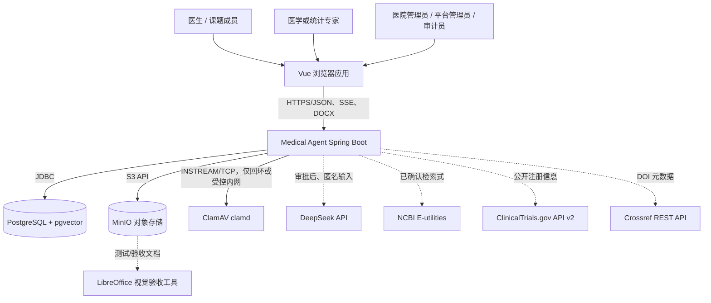

### 4.1 信任边界

| 边界 | 信任判断 |
| --- | --- |
| 浏览器到后端 | 不信任；必须认证、授权、CSRF、参数校验和 Trace ID 清洗 |
| 后端到 PostgreSQL | 受控内部服务；使用最小权限应用角色 |
| 后端到 MinIO | 受控内部服务；密钥只在服务端，路径仍执行医院/课题隔离 |
| 后端到 clamd | 受控内部服务；Windows 未加密 TCP 必须限制在回环地址 |
| 后端到外部模型 | 不信任外部处理方；默认关闭，出站前执行隐私与注入门禁 |
| 后端到公共科研 API | 外部不可靠；超时、限流、协议校验、原始响应哈希和失败关闭 |
| DOCX 模板 | 不信任上传内容；执行包安全检查、占位符白名单和结构位置校验 |

## 5. 部署容器视图

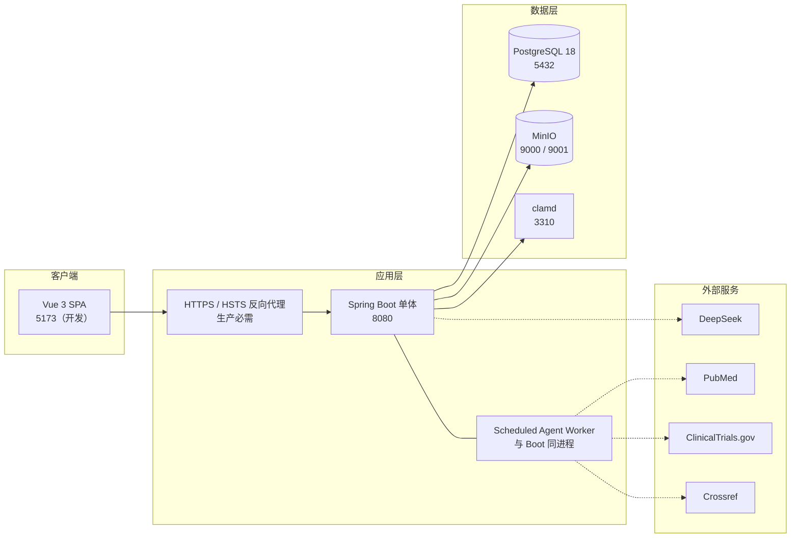

开发时 Vite 直接把 `/api` 代理到 8080。生产时应由同源 HTTPS 反向代理同时提供静态前端和
后端 API，避免为 Cookie/CSRF 引入不必要的跨域配置。

当前 Worker 与 Web API 在同一 JVM 中。PostgreSQL 是任务事实源，因此浏览器断开不影响任务；
但第一版仍按单应用节点设计。多节点前需要重新评估 Worker 抢占容量、跨节点 SSE 和本地缓存。

## 6. 运行 profile 与适配器

### 6.1 Profile 矩阵

| Profile | Repository | ObjectStorage | 典型用途 |
| --- | --- | --- | --- |
| `memory` | ConcurrentMap / PlatformStore | 内存对象存储 | 快速演示、单元和 HTTP 测试 |
| `postgres` | Spring JDBC | MinIO 或失败关闭适配器 | 本地集成、正式持久化 |
| `postgres,prod` | Spring JDBC | MinIO | 生产安全基线 |

`memory` 不启用 DataSource 和 Flyway。它用于快速反馈，不验证 PostgreSQL JSONB、索引、约束、
锁、租约或事务语义。

`postgres` 激活 JDBC 仓储和 Flyway。若 `MINIO_ENABLED=false`，系统注入
`DisabledObjectStorage`，任何需要对象存储的操作都会显式失败。

`prod` 是叠加 profile，不单独提供持久化。它强制 Secure Cookie、关闭开发文档并使用 ClamAV。

### 6.2 条件式端口实现

| 端口/接口 | 开发实现 | 正式实现 |
| --- | --- | --- |
| `ModelRouter` | `MockModelRouter` | `DeepSeekModelRouter` |
| `PubMedSearchGateway` | `MockPubMedSearchGateway` | `NcbiPubMedSearchGateway` |
| `ClinicalTrialsSearchGateway` | `MockClinicalTrialsSearchGateway` | `ClinicalTrialsGovSearchGateway` |
| `CrossrefMetadataGateway` | `MockCrossrefMetadataGateway` | `CrossrefRestMetadataGateway` |
| `ObjectStorage` | `MemoryObjectStorage` | `MinioObjectStorage` |
| `MalwareScanner` | `BasicMalwareScanner` | `ClamAvMalwareScanner` |
| 各领域 Repository | `Memory*Repository` | `Jdbc*Repository` |

选择由 Spring profile 或配置属性完成，业务服务不读取供应商密钥，也不自行实例化实现。

## 7. 逻辑分层与代码组织

后端采用模块化单体和端口/适配器风格。没有拆分为微服务，领域间调用保持 JVM 内同步调用；
耗时工作通过持久化任务和 Worker 解耦浏览器请求。

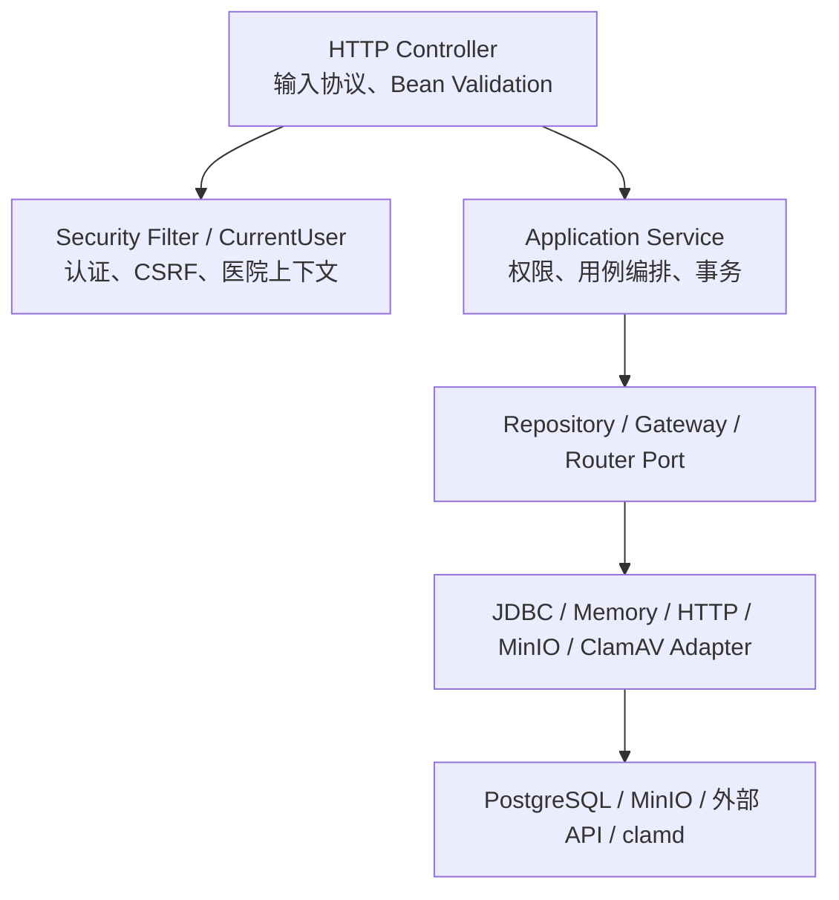

### 7.1 包职责

| 包 | 职责 |
| --- | --- |
| `common` | 统一响应、异常映射、Trace ID、OpenAPI |
| `auth` | 登录、会话、密码、认证过滤器、Spring Security |
| `hospital` | 平台医院和医院用户管理 |
| `audit` | 操作审计记录和范围查询 |
| `research` | 课题、幂等创建、乐观锁、成员权限 |
| `file` | 上传校验、恶意扫描、文本提取、对象存储 |
| `agent` | 模型端口、Mock/DeepSeek、Prompt、原型服务和评测 |
| `safety` | 敏感内容、Prompt Injection 和最终出站门禁 |
| `literature` | PubMed、ClinicalTrials.gov、Crossref 和证据关联 |
| `workflow` | 18 步任务、Worker、设计/方案/统计/引用/STROBE |
| `review` | 专家批注、决定、负责人确认和历史 |
| `document` | 模板、引用格式、DOCX 渲染、导出和下载 |
| `infrastructure` | 启动引导和内存平台存储 |

### 7.2 依赖规则

ArchUnit 当前强制 Controller 不直接依赖：

- Mock 模型实现。
- `literature` 外部工具实现。
- `ControlledDocxTemplateEngine`。
- `MinioObjectStorage`。

Controller 只面向应用服务。后续模块增长时应继续增加跨包依赖规则，避免 `WorkspaceView` 或
Controller 逐步成为底层集成编排器。

## 8. 前端架构

前端是 Vue 3 单页应用：

- Vue Router 使用 History 模式并懒加载 `/` 和 `/workspace`。
- Pinia 保存当前会话，并通过 `/api/auth/me` 恢复登录状态。
- Axios 统一启用 `withCredentials`。
- Axios 从 `XSRF-TOKEN` Cookie 读取 Token，写入 `X-XSRF-TOKEN` Header。
- `v-permission` 只控制界面显示，不能替代后端授权。
- Vite 开发服务器把 `/api` 代理到后端。
- SSE 用于任务通知；页面刷新后仍以任务查询接口恢复事实状态。

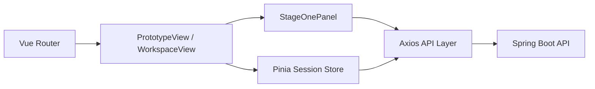

当前大量工作台交互集中在 `WorkspaceView.vue`、`StageOnePanel.vue` 和单个大型
`platform.ts` API 文件。功能继续增长时，应按“身份与课题、Agent、审核、文档”拆分前端模块，
但不能改变后端作为授权事实源的原则。

## 9. 后端请求链

### 9.1 认证写请求

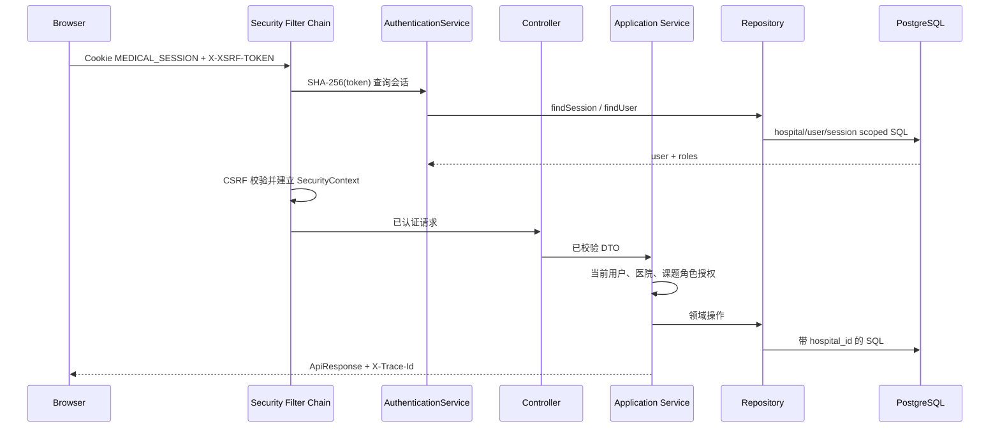

登录接口是唯一忽略 CSRF 的写接口。其余写请求必须同时满足会话、CSRF、平台角色和领域权限。
浏览器采用 `XSRF-TOKEN` Cookie 与 `X-XSRF-TOKEN` Header 双提交；后端使用
`CsrfTokenRequestAttributeHandler` 解析 SPA 原始令牌，避免 Spring Security 6 默认 XOR 处理
与 Axios Cookie 模式不兼容。该调整只改变令牌表示解析，不降低 CSRF 校验范围。

### 9.2 统一响应与错误

普通 JSON 响应使用：

```text
ApiResponse<T>(
  success,
  data,
  error(code, message, traceId),
  timestamp,
  traceId
)
```

错误响应不包含堆栈或敏感原文。`server.error.include-message=never`，日志通过 MDC 记录 Trace ID。

## 10. 认证、授权与多医院隔离

### 10.1 会话模型

1. 用户使用医院代码、用户名和密码登录。
2. 医院代码只用于定位账号，不进入普通课题 API。
3. BCrypt cost 12 校验密码。
4. 登录成功生成两个 UUID 拼接的不透明 Token。
5. 浏览器获得 `MEDICAL_SESSION`；数据库只保存 Token SHA-256。
6. 会话有效期 8 小时。
7. 修改密码、禁用账号或注销会撤销会话。

### 10.2 密码策略

- 至少 12 位。
- 包含大写、小写字母和数字。
- 新用户默认 `force_password_change=true`。
- 连续 5 次失败锁定 15 分钟。

### 10.3 授权层次

```text
平台角色
  ├─ PLATFORM_ADMIN：跨医院平台管理
  ├─ HOSPITAL_ADMIN：本院用户、模板和引用格式管理
  ├─ AUDIT_ADMIN：授权范围内审计
  ├─ DOCTOR：科研业务
  └─ EXPERT：专家审核

课题成员角色
  ├─ OWNER：课题负责人、成员管理、最终确认与导出
  ├─ EDITOR：课题编辑和人工工作流确认
  └─ VIEWER：只读
```

平台角色与课题成员角色同时生效。具备 `EXPERT` 平台角色但未加入课题的用户不能审核该课题。

### 10.4 租户约束

- 普通用户的 `hospital_id` 从已认证用户对象取得。
- Repository 查询显式接受医院范围，JDBC SQL 同时过滤 `hospital_id` 和资源 ID。
- 跨院资源通常返回不可见或禁止，避免确认资源是否存在。
- 业务唯一键和索引包含医院范围。
- MinIO 路径包含医院标识，下载时仍重新执行数据库权限检查。

当前隔离不是 PostgreSQL Row Level Security。应用层约束、数据库联合键和自动化测试共同构成
防线；若未来需要更强纵深防御，可评估 RLS，但必须处理连接池会话上下文和迁移复杂度。

## 11. Agent 运行时架构

### 11.1 核心事实

- `ai_agent_task` 保存任务当前状态。
- `ai_agent_step_run` 保存每步、每次尝试的不可缺失运行信息。
- `ai_agent_event` 保存单调递增事件 ID，用于 SSE 重放。
- `ai_agent_clarification_round` 保存不可变澄清轮次。
- PostgreSQL 是正式事实源，SSE 不是消息事实源。

### 11.2 Worker 领取与恢复

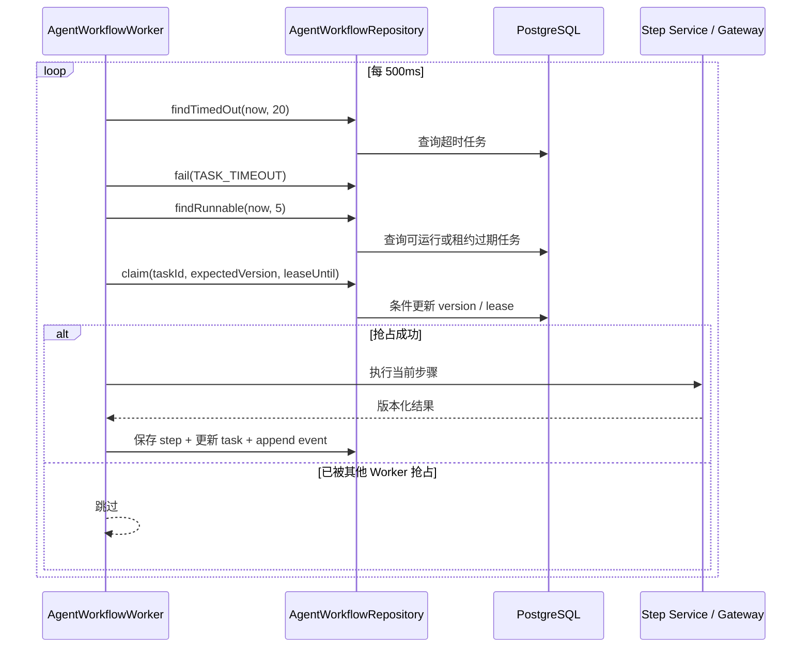

默认租约为 30 秒，任务总超时 15 分钟。领取使用任务版本号和条件更新，避免同一任务被重复执行。
应用异常退出后，租约过期任务可以重新进入可运行集合。

### 11.3 状态

任务对外主要状态：

```text
QUEUED
  → RUNNING
  → WAITING_CONFIRMATION
  → REVISION_REQUIRED
  → COMPLETED
  → FAILED
  → CANCELLED
```

人工确认阶段不持有 Worker 线程或数据库事务。提交确认时验证任务当前步骤、版本、操作者权限和
输入契约，然后原子更新任务输入/输出、步骤确认信息和下一步骤。

### 11.4 SSE

- 任务变化先写入 `ai_agent_event`。
- SSE 读取数据库事件，并把事件 ID 发送给浏览器。
- 浏览器重连可用 `Last-Event-ID` 请求缺失事件。
- SSE 断开不会取消任务。
- 浏览器最终仍通过 GET 任务接口读取事实状态。

第一版事件发送器保存在应用进程内，因此多节点前需要为实时分发增加共享消息层；数据库事件表
仍应保留为审计和重放事实源。

## 12. 18 步科研工作流

### 12.1 步骤分组

| 范围 | 目的 | 主要组件 |
| --- | --- | --- |
| STEP01～03 | 结构化与澄清 | `PrototypeService`、模型路由、澄清轮次 |
| STEP04～07 | 方向、PECO、检索式 | Prompt、规则注册表、`SearchStrategyService` |
| STEP08～10 | 外部证据检索和核验 | PubMed、ClinicalTrials.gov、Crossref |
| STEP11～12 | 相似研究和设计推荐 | 确定性五维比较、观察性研究规则 |
| STEP13～16 | 方案、统计、引用、STROBE | 版本化确定性生成服务 |
| STEP17 | 专家与负责人审核 | `ExpertReviewService` |
| STEP18 | 受控导出 | 模板引擎、引用样式、对象存储 |

### 12.2 人工门禁

| 门禁 | 约束 |
| --- | --- |
| STEP03 澄清 | 所有问题必须有有效答案；每轮不可变保存 |
| STEP05 方向 | 编辑者选择方向；也可修订澄清并使旧方向失效 |
| STEP07 检索式 | 确认前禁止真实 PubMed 检索；保存生成式和最终式 |
| STEP12 设计 | 必须确认研究类型、主要终点并授权正式方案生成 |
| STEP17 专家 | 只有同院、已入课题的 EXPERT 可批注和决定 |
| STEP17 负责人 | 专家通过后 OWNER 再确认并锁定章节 |
| STEP18 导出 | OWNER 选择已发布模板和引用格式后执行 |

### 12.3 版本化输出

关键输出包含显式 Schema 或算法版本，例如：

- `research-analysis/v1`
- `research-idea-profile/v1`
- `search-strategy/v1`
- `pubmed-query/v1`
- `clinicaltrials-query/v1`
- `deterministic-peco-overlap/v1`
- `deterministic-observational-protocol/v1`
- `deterministic-observational-statistics/v1`
- `deterministic-claim-citation-linker/v1`
- `deterministic-strobe-2007-precheck/v1`
- `controlled-docx-placeholders/v2`

版本写入步骤、领域表或导出快照，使历史结果可以解释和重放。算法升级不得静默改变旧记录语义。

## 13. 模型架构与出站控制

### 13.1 模型路由

业务代码依赖 `ModelRouter` 和逻辑模型类型，不依赖具体供应商。当前：

- `mock`：确定性实现，只用于默认无网络构建、单元测试和快速回归。
- `deepseek`：OpenAI 兼容 `/chat/completions`；当前 Windows 本地启动脚本强制启用。

供应商、模型名、Base URL 和密钥只来自服务端配置。
受认证的 `/api/runtime/model` 只返回 Provider、模式、模型名和外部调用开关，供页面和自动化
验明确认实际路由；接口不返回 Base URL、密钥路径或密钥内容。

### 13.2 DeepSeek 调用时序

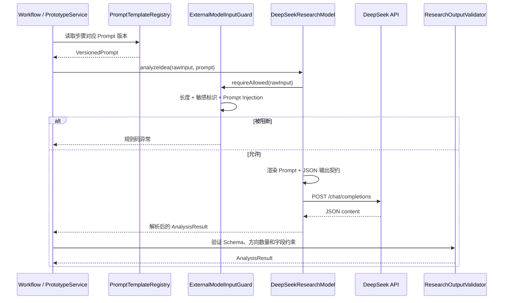

安全门禁位于最终适配器调用点，不能只依赖 Controller、页面或上游文件流程。输入被拒绝时
WireMock 测试确认外部请求次数为 0。

### 13.3 不降级原则

- 外部模型失败不会切换到另一家未审批供应商。
- JSON 解析或契约失败不会用自由文本继续。
- 缺少密钥或第二开关时 DeepSeek Bean 拒绝初始化。
- 模型不得猜测患者数据、样本量或医学结论。

## 14. 文献工具架构

### 14.1 PubMed

真实实现使用 NCBI E-utilities：

1. ESearch 获取 PMID 集合。
2. ESummary 获取题名和摘要元数据。
3. EFetch 获取文章 XML。
4. 交叉校验 PMID、重复记录和题名映射。
5. 保存结构化文献、课题关联、原始响应和 SHA-256。

XML 解析启用 Java 安全处理，禁止外部 DTD、外部 Schema、外部实体和 XInclude，同时保留
NCBI 合法 DOCTYPE 的协议兼容。

### 14.2 ClinicalTrials.gov

- 使用 API v2 `/studies`。
- 从已确认 PECO 概念生成版本化查询。
- 校验 NCT ID、题名、状态、研究类型和重复 ID。
- 保存阶段、疾病、干预、终点、申办者、日期、入组数、国家和关联 PMID。
- 注册研究始终保留独立来源属性。

### 14.3 Crossref

- 按 DOI 查询 `/works/{doi}`。
- 比较 DOI、题名、作者、期刊和发表年份。
- 支持 public/polite pool、`Retry-After`、有界重试和 24 小时缓存。
- 404 记录为单篇 `CROSSREF_NOT_FOUND`，服务或协议错误使步骤失败。
- 将注册研究公开 PMID 与 PubMed 文献建立已解析或未解析关联。

### 14.4 原始响应与事务边界

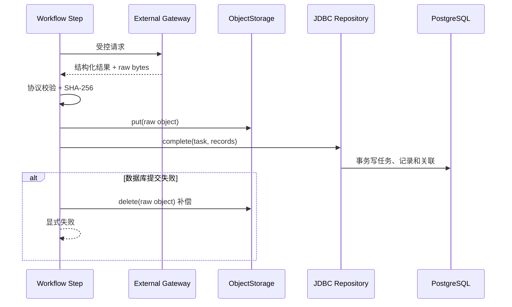

PostgreSQL 与 MinIO 之间没有分布式事务。系统采用“对象先写、数据库失败补偿删除”的小型 Saga。
如果补偿本身失败，会把清理异常附加到主异常并保留日志，后续应由运维清理孤儿对象。

## 15. 文件安全架构

### 15.1 上传时序

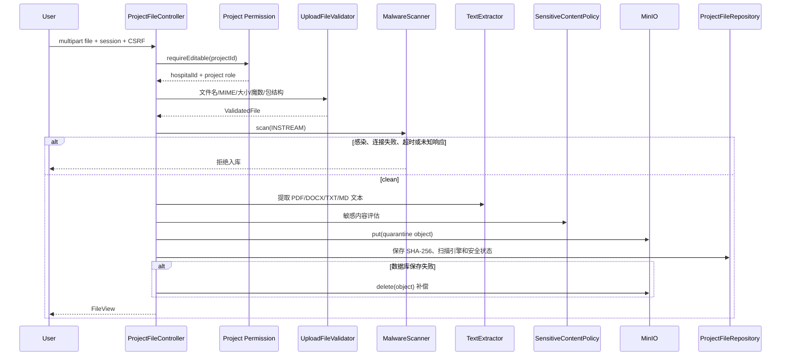

### 15.2 校验限制

| 控制 | 限制 |
| --- | --- |
| 请求大小 | 文件 20MB，请求 21MB |
| 扩展名 | PDF、DOCX、TXT、MD |
| 文件名 | 去路径、控制字符替换、最大 180 字符 |
| DOCX | ZIP 魔数、必须含 `[Content_Types].xml` 和 `word/document.xml`，最多 500 条目 |
| 文本 | TXT/MD 必须是严格 UTF-8 |
| PDF 文本提取 | 最多 200 页 |
| 提取文本 | 最多 200,000 字符 |
| ClamAV 流 | 本机配置 25MB，扫描大小 100MB，文件大小 25MB |

### 15.3 安全状态

前端和数据库使用：

- `SAFE`
- `WARNING`
- `BLOCKED_FOR_EXTERNAL_MODEL`
- `REQUIRES_ADMIN_REVIEW`

文件可以因合规需要保存在医院课题隔离区，但只要状态不允许外发，外部模型适配器仍会再次阻断。

## 16. 受控 DOCX 架构

### 16.1 模板生命周期

```text
上传或安装内置模板
  → DOCX 包安全检查
  → 占位符白名单与结构校验
  → VALIDATED 版本
  → 匿名试生成
  → 医院管理员发布
  → PUBLISHED 唯一版本
  → STEP18 选择并导出
  → ARCHIVED（后续版本替代时）
```

模板使用 `controlled-docx-placeholders/v2`，支持：

- 15 个既有文本占位符。
- `${project.logo}` 安全图片占位。
- 5 类 Word 原生项目符号列表。
- `${repeat.ref.index}` / `${repeat.ref.text}` 参考文献表格重复行。

结构指令必须独占段落，参考文献重复指令必须位于同一表格行。Logo 仅允许不超过 1MB 的
PNG/JPEG，宽高不超过 2000 像素，并在 480×160 边界内等比缩放。

### 16.2 引用格式

医院引用格式独立版本化并发布。当前布局：

- `VANCOUVER`
- `GB_T_7714`

可配置作者显示上限、省略文本、DOI 和证据范围标记；PMID 数据库约束要求始终保留。

### 16.3 导出一致性

导出前重新确认：

- 任务位于 STEP18。
- 方案已由专家通过和负责人确认。
- 当前章节版本已锁定。
- 审核快照和方案快照一致。
- 模板、引用格式已在同一医院发布。
- 所有参考文献 PMID 来自 STEP10 已核验记录。

导出保存模板版本、引用格式版本、确认人、方案快照 SHA-256、引文快照 SHA-256、最终文件
SHA-256、对象路径和时间。

## 17. 数据架构

### 17.1 概念关系

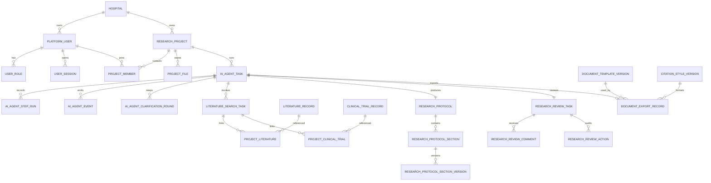

### 17.2 迁移目录

| 迁移 | 领域变化 |
| --- | --- |
| V1 | pgvector、医院、课题、Agent 任务和步骤 |
| V2 | 用户、角色、会话、登录/操作审计、幂等 |
| V3 | 课题文件元数据 |
| V4 | 课题成员 |
| V5 | 文件扫描引擎、提取状态和字符数 |
| V6 | 任务取消/超时/错误/幂等/时间字段，Agent 事件 |
| V7 | 不可变澄清轮次 |
| V8 | PubMed 检索任务、文献、课题文献关联 |
| V9 | ClinicalTrials.gov 注册研究和课题关联 |
| V10 | Crossref 引文核验和跨来源关联 |
| V11 | 相似研究比较和潜在空白 |
| V12 | 观察性研究设计建议和备选 |
| V13 | 研究方案、章节和章节版本 |
| V14 | 统计草案和样本量参数需求 |
| V15 | 主张、引文链接和验证任务 |
| V16 | STROBE 检查任务和条目 |
| V17 | 专家审核、批注和不可变动作历史 |
| V18 | DOCX 模板版本和导出记录 |
| V19 | 医院引用格式版本及导出关联 |

V1～V19 创建 44 张业务表。PostgreSQL 中看到的第 45 张 public 表是
`flyway_schema_history`。

### 17.3 数据建模约定

- 主键以 UUID 为主，事件使用 `BIGSERIAL` 保证顺序。
- 所有医院业务表显式保存 `hospital_id`。
- 复杂版本化输出使用 JSONB，同时保留可查询的核心关系字段。
- `version BIGINT` 用于乐观锁或变更版本。
- 公开标识使用数据库 CHECK，例如 PMID、NCT ID、状态枚举。
- 原始大对象不放入 PostgreSQL，数据库保存 MinIO 路径和 SHA-256。
- 删除课题相关运行记录时使用经过设计的 `ON DELETE CASCADE`；共享文献记录不随单个课题删除。

## 18. 对象存储架构

默认存储桶为 `medical-agent-files`。对象键按用途隔离：

| 类型 | 对象键 |
| --- | --- |
| 上传文件 | `{hospitalId}/{projectId}/quarantine/{fileId}/{safeName}` |
| PubMed 原始响应 | `{hospitalId}/{projectId}/literature-search/{id}/ncbi-eutils-raw-v1.json` |
| ClinicalTrials.gov 原始响应 | `{hospitalId}/{projectId}/literature-search/{id}/clinicaltrials-api-v2-raw.json` |
| Crossref 原始响应 | `{hospitalId}/{projectId}/literature-validation/{id}/crossref-raw-v1.json` |
| DOCX 模板 | `hospital/{hospitalId}/document-templates/{code}/v{n}/{id}.docx` |
| 导出文档 | `hospital/{hospitalId}/projects/{projectId}/exports/{id}/{fileName}` |

对象键本身不能替代授权。读取模板和导出文档前，服务会核对医院、课题成员、记录关系和路径前缀。

## 19. 事务、一致性与幂等

### 19.1 数据库事务

以下高价值操作使用 `@Transactional`：

- 课题创建、更新和成员添加。
- 澄清、检索式、设计确认和 STEP17→STEP18 状态推进。
- 文献/注册研究/核验记录及其关联批量完成。
- 方案、统计、主张引用和 STROBE 结果保存。
- 专家批注、决定、负责人确认和章节锁定。
- 模板/引用格式发布。
- 最终文档确认和导出记录更新。

### 19.2 幂等

- 课题创建和 Agent 任务创建要求 `Idempotency-Key`。
- 幂等范围包含医院、用户、操作和 Key。
- 相同范围和 Key 重放返回已有资源，而不是创建重复资源。
- Agent 步骤使用 `(hospital_id, task_id, step_code, attempt_no)` 唯一约束。

### 19.3 乐观并发

- 课题更新要求预期版本。
- 任务领取、确认、取消、重试和审核状态转换使用版本或条件状态。
- 模板与引用格式发布使用事务，保证一个医院/代码只有一个已发布版本。

### 19.4 跨存储补偿

MinIO 与 PostgreSQL 无原子事务。当前约定：

1. 计算和校验内容。
2. 先写对象。
3. 再写数据库事实记录。
4. 数据库失败时删除对象。
5. 补偿失败写日志并附加异常，不能伪装为成功。

未来对象量扩大后，应增加定期孤儿对象扫描和基于数据库引用的清理作业。

## 20. 安全架构

### 20.1 控制矩阵

| 威胁 | 控制 |
| --- | --- |
| 账号暴力破解 | BCrypt、5 次失败锁定 15 分钟、登录审计 |
| 会话 Token 泄露 | 不透明 Token、服务端只存 SHA-256、HttpOnly、SameSite=Strict |
| CSRF | CookieCsrfTokenRepository；除登录外写接口均校验 |
| 跨医院读取/修改 | 认证医院上下文、课题成员、SQL `hospital_id`、联合约束和回归测试 |
| IDOR 下载 | 数据库关系、医院/课题成员和对象路径前缀重新校验 |
| 恶意上传 | 类型、MIME、魔数、包结构、ClamAV、提取限制 |
| ZIP/解析炸弹 | DOCX 条目上限、ClamAV 大小/递归/文件数限制、PDF 页数和文本长度限制 |
| Prompt Injection | 输入视为不可信数据、规则门禁、系统契约、无工具执行 |
| 敏感数据外发 | 最终适配器统一门禁，禁止用户绕过 |
| XXE | 安全 XML 特性、禁止外部 DTD/Schema/实体和 XInclude |
| 外部 API 伪数据 | 标识和题名交叉校验、原始响应哈希、失败关闭 |
| Swagger 暴露 | prod 关闭且安全链不匿名放行 |
| 开发 Cookie 误入生产 | prod 构造时强制 Secure |
| 病毒扫描服务不可用 | 失败关闭，不保存文件 |
| 凭据进入仓库 | 环境变量/密钥文件、`.gitignore`、DPAPI 本地凭据 |

### 20.2 生产安全 profile

生产必须使用：

```text
SPRING_PROFILES_ACTIVE=postgres,prod
```

并满足：

- HTTPS 和 HSTS 反向代理。
- `MEDICAL_SESSION` 包含 `Secure`。
- Swagger/OpenAPI 关闭。
- ClamAV 可用且不暴露到公网。
- PostgreSQL 应用角色非超级用户。
- MinIO 使用专用最小权限凭据。
- 外部模型默认关闭，审批后才启用。
- 日志和监控不记录密钥或输入原文。

### 20.3 当前安全边界的已知缺口

- 未启用数据库 RLS。
- 没有集中式 Secret Manager 适配器，本机使用环境变量或 DPAPI 文件。
- 没有管理员文件复核/发布工作台。
- Java 依赖 SCA 首次 NVD 同步尚未完成。
- 容器/镜像扫描因当前环境无 Docker 尚未执行。

## 21. 可观测性

### 21.1 Trace ID

- 请求可携带 `X-Trace-Id`。
- 只接受 8～64 位安全字符。
- 不合法或缺失时生成新值。
- Trace ID 写入响应头、统一响应体和 MDC 日志。

### 21.2 审计

审计数据分为：

- `operation_audit`：当前实际承载登录、医院、用户、课题、文件、任务、审核和文档操作。
- `login_audit`：V2 预留的专用登录审计表，当前登录事件尚未单独写入该表。
- `research_review_action`：审核领域不可变历史。
- `ai_agent_event`：任务运行和人工确认事件。

审计接口按平台角色和医院范围过滤，不允许普通用户读取其他医院记录。

### 21.3 运行健康

应用引入 Actuator，但只暴露 `health`，并将详情和组件列表设为永不显示：

| 路径 | 语义 | 匿名访问 |
| --- | --- | --- |
| `/actuator/health` | 深度聚合：应用、数据库、对象存储、启用时的 ClamAV | 允许 |
| `/actuator/health/liveness` | Spring 进程存活状态 | 允许 |
| `/actuator/health/readiness` | Spring 进程接收请求状态 | 允许 |

数据库使用 Spring Boot JDBC 健康指示器；MinIO 通过实际存储桶可达性判断；ClamAV 使用
回环 TCP 的 `zPING`/`PONG` 协议。探针失败只产生整体 `DOWN`，不附带主机、端口或异常。
`env` 等其他管理端点既不暴露也不匿名放行。启动门禁和完整依赖验收使用总健康，进程
`liveness` 不依赖外部服务，避免依赖抖动造成重启风暴。

### 21.4 当前日志

日志为结构化程度有限的单行文本，包含时间、级别、Trace ID、Logger 和消息。本机启动脚本将
后端及 clamd 标准输出/错误输出写入 `artifacts/runtime`。

当前没有 Micrometer 指标导出、集中日志或分布式追踪。生产部署前至少应补充：

- HTTP 延迟和错误率。
- Worker 可运行任务、失败和租约恢复数量。
- 外部 API 延迟、限流和重试次数。
- ClamAV 不可用和感染检出告警。
- MinIO/数据库连接和容量告警。

## 22. 性能、容量与限制

| 项目 | 当前限制或策略 |
| --- | --- |
| Worker 轮询 | 默认 500ms |
| 单轮领取 | 最多 5 个可运行任务 |
| 单轮超时处理 | 最多 20 个任务 |
| 任务租约 | 30s |
| 任务总超时 | 15m |
| SSE | 30m，数据库事件补发 |
| 文件 | 20MB |
| 外部模型直接输入 | 4,000 字符 |
| PubMed 默认返回 | 最多 20 条 |
| ClinicalTrials.gov 默认返回 | 最多 20 条 |
| ClinicalTrials.gov 缓存 | 12h，本机 Caffeine |
| Crossref 缓存 | 24h，本机 Caffeine |
| DOCX Logo | 1MB、2000×2000 |

当前配置适合单节点开发和小规模试点。出现以下任一情况时应重新做容量设计：

- 多应用实例。
- 持续任务积压或单步执行时间接近租约。
- SSE 连接数显著增长。
- 外部 API 配额成为瓶颈。
- 对象存储和原始响应积累需要生命周期策略。
- Caffeine 缓存需要跨节点一致。

## 23. 部署拓扑

### 23.1 内存开发

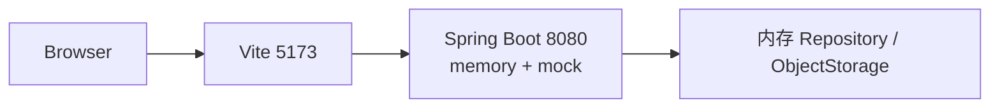

优点是快速；缺点是进程退出数据丢失，不能代表正式数据语义。

### 23.2 本机集成

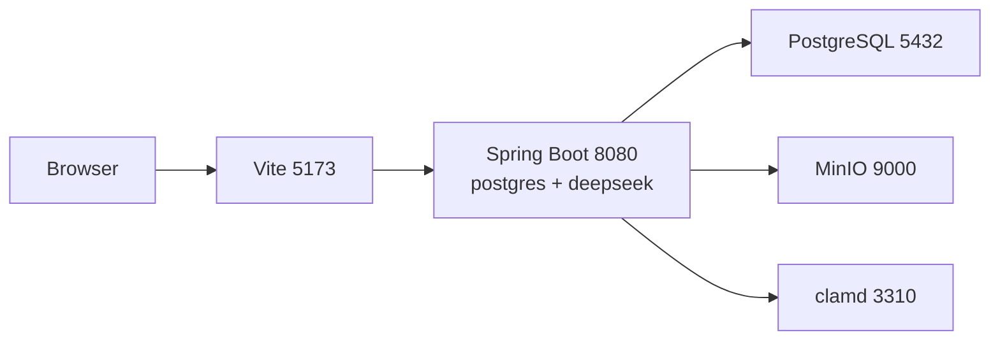

当前 Windows 脚本使用此拓扑，并在本地 HTTP 下显式覆盖 Secure Cookie 以便开发。脚本要求
非空 `deepseek_token.txt`，强制模型模式、外部调用开关和 `deepseek-v4-flash`，不配置运行期
Mock 回退。`start-local-backend.ps1` 校验端口归属、按需启动 ClamAV 并等待总健康；`status-local.ps1`
检查五项本地服务，`smoke-local.ps1` 验证健康脱敏和匿名访问边界，`stop-local-backend.ps1`
只会停止命令行包含本项目 JAR 的 8080 监听进程。

### 23.3 生产建议

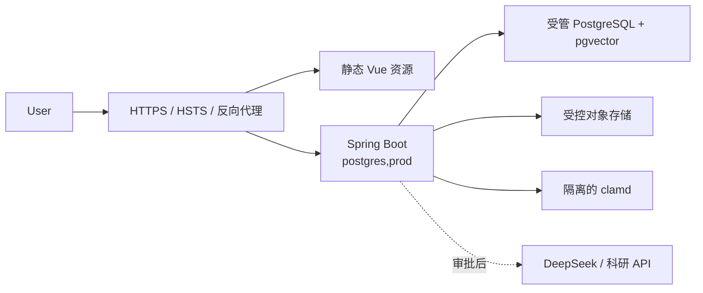

当前仓库没有生产级 Helm、Terraform、镜像或反向代理配置。部署前还需要补齐生产级备份加密与
异地副本、密钥轮换、监控告警、网络策略、容量、容灾和变更回滚方案。

### 23.4 当前备份恢复基线

PostgreSQL 与 MinIO 不具备共同快照，因此本地基线默认要求先停止后端写入，再在同一恢复点目录
生成 PostgreSQL custom archive 和 MinIO mirror。恢复点包含逐表行数、对象统计和逐文件
SHA-256 manifest，并使用 `pg_restore --list` 做归档结构校验。

恢复只允许写入不存在的安全前缀数据库和桶。新库由 `medical_agent` 所有，管理员只负责预装
pgvector；恢复清单跳过扩展自身，由应用角色恢复业务对象。恢复完成后逐表比对行数，并把新桶
对象重新下载后逐个比对 SHA-256。该策略避免脚本直接覆盖唯一正式副本。

当前实机已完成 45 张 public 表和一个合成对象的随机临时恢复演练。生产仍需增加备份加密、
异地/不可变副本、保留策略、操作审计、RPO/RTO、定期演练和正式切换/回滚编排。详细流程见
[本地备份恢复运维手册](../运维/本地备份恢复运维手册.md)。

## 24. 测试架构

### 24.1 测试层次

| 层次 | 示例 |
| --- | --- |
| 单元 | 规则、敏感内容、模型输出、模板引擎、科研确定性服务 |
| 协议 | ClamAV INSTREAM、PubMed XML、ClinicalTrials.gov JSON、Crossref |
| HTTP | 登录/CSRF、跨院隔离、Agent 人工确认、生产安全配置 |
| Repository | JDBC 课题、身份、成员、文献和工作流 |
| 实机 | PostgreSQL、MinIO、ClamAV、DeepSeek、公共科研 API |
| 架构 | ArchUnit Controller 依赖约束 |
| 前端 | Vitest、Playwright 多轮澄清、检索式确认与真实 DeepSeek STEP01→STEP07 |
| 文档 | DOCX 结构、文本、LibreOffice PDF/PNG 视觉检查 |

### 24.2 条件式实机测试原则

默认构建必须确定性、无外部副作用。实机测试通过系统属性或环境变量显式开启，并负责清理测试
数据库行和 MinIO 对象。缺少 Docker、邮箱、密钥或外部审批时测试标记跳过，不能伪报通过。

真实 DeepSeek 总控使用 18080/4174 隔离端口和 memory Profile，以
`SYNTHETIC_ANONYMOUS` 数据执行 Java 契约与浏览器认证工作流。专用运行实例仅注册 DeepSeek，
调用失败显式失败，不切换 Mock；当前 Playwright 已真实完成 STEP01→STEP07。

### 24.3 CI

GitHub Actions 当前配置为执行：

- Java 21 Maven `verify`。
- Node 24 `npm ci`。
- 前端高风险依赖审计。
- ESLint、TypeScript、Vitest、Playwright 和生产构建。

当前 CI 尚未在远端仓库实际运行，状态仍需首次推送后确认。

## 25. 架构决策

| ADR | 决策 |
| --- | --- |
| [ADR-0001](../ADR/ADR-0001-不使用H2.md) | 不用 H2 验证生产 SQL 语义 |
| [ADR-0002](../ADR/ADR-0002-第一版不使用Redis.md) | 第一版 PostgreSQL 为事实源，暂不使用 Redis |
| [ADR-0003](../ADR/ADR-0003-多医院隔离.md) | 共享表 `hospital_id` 隔离 |
| [ADR-0004](../ADR/ADR-0004-Agent任务持久化.md) | 18 步任务和步骤持久化 |
| [ADR-0005](../ADR/ADR-0005-模型路由.md) | 逻辑模型路由，供应商服务端配置 |
| [ADR-0006](../ADR/ADR-0006-受控DOCX模板协议.md) | 受控 DOCX 占位符 v2 |
| [ADR-0007](../ADR/ADR-0007-敏感数据外发阻断.md) | 外部模型最终出站默认阻断 |
| [ADR-0008](../ADR/ADR-0008-认证与会话.md) | 自建账号和不透明会话 Cookie |
| [ADR-0009](../ADR/ADR-0009-生产安全配置基线.md) | 生产 profile 失败关闭 |
| [ADR-0010](../ADR/ADR-0010-健康检查暴露边界.md) | Actuator 健康检查最小匿名暴露 |
| [ADR-0011](../ADR/ADR-0011-跨数据库与对象存储备份.md) | 停写生成跨 PostgreSQL/MinIO 一致恢复点 |

## 26. 演进路线与技术债

### 26.1 近期

- 收口 OWASP Dependency-Check Java SCA 报告。
- 补齐远端 CI 首次运行。
- 增加 Worker、外部 API、HTTP 和容量指标及告警。
- 取得两套真实脱敏医院模板并执行格式适配。
- 建立匿名历史课题和专家评测闭环。
- 增加管理员文件复核/发布工作台。

### 26.2 多节点触发后的架构变化

当单节点不再满足时，建议按顺序评估：

1. 保留 PostgreSQL 任务和事件事实源。
2. 增加共享事件分发层，用于跨节点 SSE。
3. 增加分布式缓存或 Redis，但不把缓存变成任务事实源。
4. 独立 Worker 进程并按步骤类型设置并发池。
5. 引入外部 API 配额协调和租户级限流。
6. 引入对象生命周期、孤儿清理和归档策略。

### 26.3 当前代码组织债务

- 前端工作台和 API 类型文件偏大，需要按领域拆分。
- Worker 使用步骤字符串分支，步骤继续增长时应引入显式 Step Handler 注册表。
- 当前错误码仍有部分通用 `AGENT_STEP_FAILED`，可进一步细化领域错误。
- 已有最小健康端点，仍缺少指标、告警、分布式追踪和集中日志约定。
- 已有本地备份恢复脚本和手册，仍缺生产加密、异地副本、自动保留、RPO/RTO 和灾备编排。

## 27. 架构不变量

后续开发必须保持：

1. 普通业务不得从请求参数信任 `hospital_id`。
2. Controller 不得直接调用具体供应商、MinIO、ClamAV 或 DOCX 底层实现。
3. 数据库继续作为 Agent 任务和事件事实源。
4. 人工门禁不能被 Worker 或外部模型绕过。
5. 外部模型调用必须经过最终出站门禁。
6. 外部科研数据必须保留来源、工具版本、原始响应或哈希及证据范围。
7. 失败不得生成伪造文献、伪造样本量或伪造“已核验”状态。
8. 模板和引用格式必须版本化、验证并发布后才能用于正式导出。
9. 跨 MinIO/PostgreSQL 写入必须有补偿或可审计的失败状态。
10. 新增生产便利配置时必须检查其是否可能削弱 `prod` 失败关闭基线。
